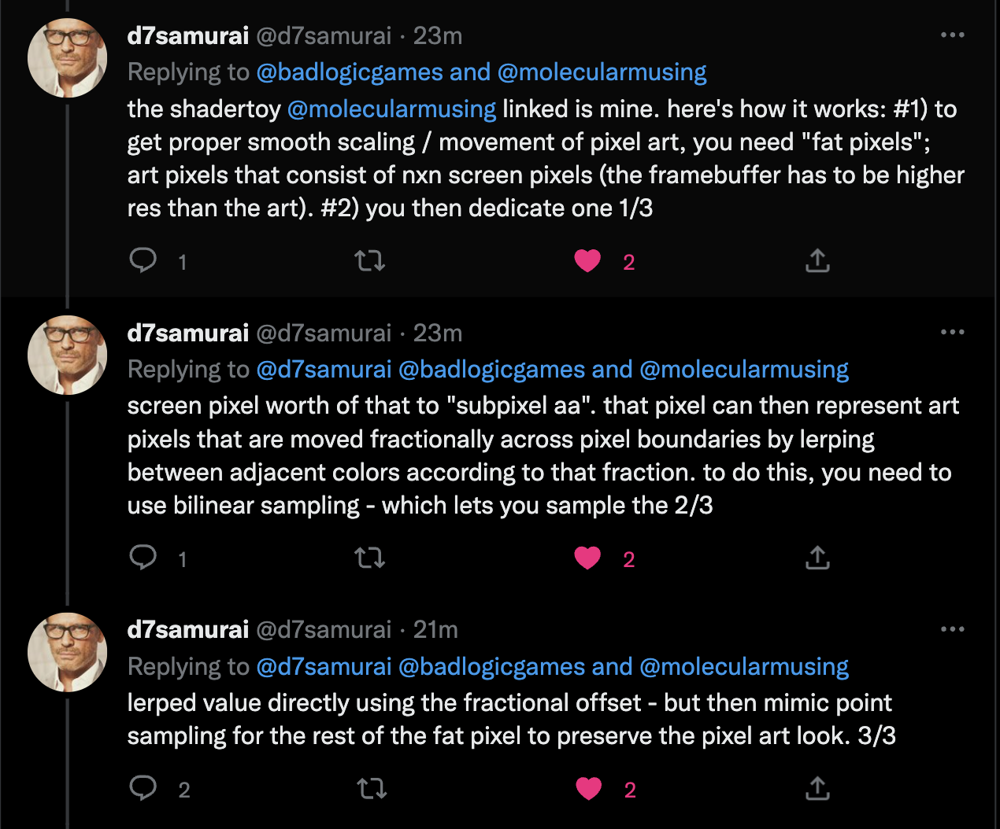

{{
metadata = {
	title: "Jitterbugs - Why moving your pixels at sub-pixel precision is hard",
	summary: "Why jittering and stuttering occurs in today's pixel-art games.",
	image: "jitterbug.jpeg",
	date: parseDate("2022/12/11 21:00"),
	published: true,
}
}}

{{include "../../_templates/post_header.bt.html"}}
{{include "../../_templates/post_header.bt.html" as post}}

{{post.figure("jitterbug.jpeg", "Your pixels hate you.")}}

<div class="table_of_contents"></div>

--markdown-begin
## The story of Pixi

You love pixel art and low-res games. Naturally, you too want to create the most beautiful, playable pixels the world has ever seen.

You start simple. Just a rectangle you move slowly across the 320x240 screen pixels, from left to right. What could go wrong?

--markdown-end
{{post.code("", "javascript",
`
// Get a CanvasRenderingContext2D from a 320x240 pixel canvas to draw with
const ctx = document.querySelector("#framebuffer").getContext("2d");

// Define Pixi, our brave little rectangle. Her position is given
// with sub-pixel precision. Every frame she'll advance by 0.15 pixels.
const pixi = { x: 0.0, y: 104.0, velocity: 0.15 };

const frame = () => {
	// Move pixi by 'velocity' pixels every frame
	pixi.x = pixi.x + pixi.velocity;

	// If pixi exits the screen, make her wrap around
	if (pixi.x >= 320) pixi.x = 0;

	// Clear the screen
	ctx.fillStyle = "black";
	ctx.fillRect(0, 0, 320, 240);

	// Draw pixi at integer pixel coordinates
	ctx.fillStyle = "red";
	ctx.fillRect(Math.floor(pixi.x), Math.floor(pixi.y), 32, 32);

	// Do another frame
	requestAnimationFrame(frame);
}

// Kick off the first frame
requestAnimationFrame(frame);
`
)}}

<div style="display: flex; flex-direction: column; align-items: center; margin-bottom: 1em;">
<canvas id="framebuffer" width="320" height="240" style="width: 640px; height: 480px; image-rendering: pixelated; background: black;"></canvas>
</div>
<script>{
// Get a CanvasRenderingContext2D from a 320x240 pixel canvas to draw with
const ctx = document.querySelector("#framebuffer").getContext("2d");

// Define Pixi, our brave little rectangle. Her position is given
// with sub-pixel precision. Every frame she'll advance by 0.15 pixels.
const pixi = { x: 0.0, y: 104.0, velocity: 0.15 };

const frame = () => {
	// Move pixi by 'velocity' pixels every frame
	pixi.x = pixi.x + pixi.velocity;

	// If pixi exits the screen, make her wrap around
	if (pixi.x >= 320) pixi.x = 0;

	// Clear the screen
	ctx.fillStyle = "black";
	ctx.fillRect(0, 0, 320, 240);

	// Draw pixi at integer pixel coordinates
	ctx.fillStyle = "red";
	ctx.fillRect(Math.floor(pixi.x), Math.floor(pixi.y), 32, 32);

	// Do another frame
	requestAnimationFrame(frame);
}

// Kick off the first frame
requestAnimationFrame(frame);
}</script>
--markdown-begin

Oh no. Pixi has a little stutter. Every now and then she seems to pause for a little bit longer than usual. Probably to think about her dreary pixel life.

## Frame-rate independent movement

Worse, if pixi moves on a 120Hz display, she'll move faster than on a 60Hz display. Pixi should really move independent of the framerate:

--markdown-end
{{post.code("", "javascript",
`
const ctx = document.querySelector("#framebuffer2").getContext("2d");

// Pixi's velocity is now given as pixels/second. She should move
// 9 pixels per second.
const pixi = { x: 0.0, y: 104.0, velocity: 9.0 };

// Store a timestamp for when we started updating the last frame.
let lastTime = performance.now();

const frame = () => {
	// Calculate how much time has passed since the last time in seconds.
	// For a screen refresh rate of 60Hz, the time step will be around 0.016
	// seconds, or 16 milliseconds.
	const now = performance.now();
	const timeStep = (now - lastTime) / 1000.0;
	lastTime = now;

	// Move pixi using the time step
	pixi.x = pixi.x + pixi.velocity * timeStep;

	// If pixi exits the screen, make her wrap around
	if (pixi.x >= 320) pixi.x = 0;

	ctx.fillStyle = "black";
	ctx.fillRect(0, 0, 320, 240);

	ctx.fillStyle = "red";
	ctx.fillRect(Math.floor(pixi.x), Math.floor(pixi.y), 32, 32);

	requestAnimationFrame(frame);
}

requestAnimationFrame(frame);
`
)}}

<div style="display: flex; flex-direction: column; align-items: center; margin-bottom: 1em;">
<canvas id="framebuffer2" width="320" height="240" style="width: 640px; height: 480px; image-rendering: pixelated; background: black;"></canvas>
</div>
<script>{
const ctx = document.querySelector("#framebuffer2").getContext("2d");

// Pixi's velocity is now given as pixels/second. She should move
// 9 pixels per second.
const pixi = { x: 0.0, y: 104.0, velocity: 9.0 };

// Store a timestamp for when we started updating the last frame.
let lastTime = performance.now();

const frame = () => {
	// Calculate how much time has passed since the last time in seconds.
	// For a screen refresh rate of 60Hz, the time step will be around 0.016
	// seconds, or 16 milliseconds.
	const now = performance.now();
	const timeStep = (now - lastTime) / 1000.0;
	lastTime = now;

	// Move pixi using the time step
	pixi.x = pixi.x + pixi.velocity * timeStep;

	// If pixi exits the screen, make her wrap around
	if (pixi.x >= 320) pixi.x = 0;

	ctx.fillStyle = "black";
	ctx.fillRect(0, 0, 320, 240);

	ctx.fillStyle = "red";
	ctx.fillRect(Math.floor(pixi.x), Math.floor(pixi.y), 32, 32);

	requestAnimationFrame(frame);
}

requestAnimationFrame(frame);
}</script>
--markdown-begin

OK, cool. Pixi is moving at a constant velocity now, irrespective of the screen refresh rate. But she's even more jittery and stuttery than before! Pixi, what is you doin'?

## Numerically and visually analyzing Pixi's stutter
Pixi is suffering from multiple fatal issues. Logging Pixi's truncated pixel precise position at which she's rendered, her "true" sub-pixel precise position, and the time step gives some insights:

```
pixel x: 0, sub-pixel x: 0.050399999141693116, time step: 0.005599999904632568
pixel x: 0, sub-pixel x: 0.12329999828338624, time step: 0.008099999904632569
pixel x: 0, sub-pixel x: 0.12689999914169312, time step: 0.00040000009536743164
pixel x: 0, sub-pixel x: 0.20519999957084656, time step: 0.008700000047683716
pixel x: 0, sub-pixel x: 0.2753999991416931, time step: 0.007799999952316284
pixel x: 0, sub-pixel x: 0.35279999828338626, time step: 0.008599999904632569
pixel x: 0, sub-pixel x: 0.42659999871253973, time step: 0.008200000047683715
pixel x: 0, sub-pixel x: 0.5111999995708466, time step: 0.009400000095367431
pixel x: 0, sub-pixel x: 0.5715, time step: 0.006700000047683716
pixel x: 0, sub-pixel x: 0.6596999995708466, time step: 0.009799999952316283
pixel x: 0, sub-pixel x: 0.7280999987125397, time step: 0.007599999904632568
pixel x: 0, sub-pixel x: 0.8027999982833862, time step: 0.008299999952316284
pixel x: 0, sub-pixel x: 0.873, time step: 0.007800000190734863
pixel x: 0, sub-pixel x: 0.9495, time step: 0.0085

pixel x: 1, sub-pixel x: 1.0232999982833864, time step: 0.008199999809265137
pixel x: 1, sub-pixel x: 1.0997999982833864, time step: 0.0085
pixel x: 1, sub-pixel x: 1.1852999982833863, time step: 0.0095
pixel x: 1, sub-pixel x: 1.2788999991416932, time step: 0.010400000095367432
pixel x: 1, sub-pixel x: 1.3193999991416931, time step: 0.0045
pixel x: 1, sub-pixel x: 1.404899999141693, time step: 0.0095
pixel x: 1, sub-pixel x: 1.4723999991416932, time step: 0.0075
pixel x: 1, sub-pixel x: 1.5470999987125398, time step: 0.008299999952316284
pixel x: 1, sub-pixel x: 1.6253999991416932, time step: 0.008700000047683716
pixel x: 1, sub-pixel x: 1.71, time step: 0.009400000095367431
pixel x: 1, sub-pixel x: 1.773899999141693, time step: 0.007099999904632569
pixel x: 1, sub-pixel x: 1.8476999995708465, time step: 0.008200000047683715
pixel x: 1, sub-pixel x: 1.9241999995708465, time step: 0.0085

pixel x: 2, sub-pixel x: 2.0015999987125395, time step: 0.008599999904632569
pixel x: 2, sub-pixel x: 2.0861999995708462, time step: 0.009400000095367431
pixel x: 2, sub-pixel x: 2.1545999987125395, time step: 0.007599999904632568
pixel x: 2, sub-pixel x: 2.2301999995708464, time step: 0.008400000095367432
pixel x: 2, sub-pixel x: 2.3120999987125392, time step: 0.009099999904632568
pixel x: 2, sub-pixel x: 2.3750999987125394, time step: 0.007
pixel x: 2, sub-pixel x: 2.463299998283386, time step: 0.009799999952316283
pixel x: 2, sub-pixel x: 2.5172999982833857, time step: 0.006
pixel x: 2, sub-pixel x: 2.5982999982833856, time step: 0.009
pixel x: 2, sub-pixel x: 2.6702999982833857, time step: 0.008
pixel x: 2, sub-pixel x: 2.7449999999999997, time step: 0.008300000190734864
pixel x: 2, sub-pixel x: 2.827799998283386, time step: 0.009199999809265136
pixel x: 2, sub-pixel x: 2.8988999991416926, time step: 0.007900000095367432
pixel x: 2, sub-pixel x: 2.9771999995708462, time step: 0.008700000047683716

pixel x: 3, sub-pixel x: 3.0428999991416927, time step: 0.007299999952316285
pixel x: 3, sub-pixel x: 3.1211999995708464, time step: 0.008700000047683716
pixel x: 3, sub-pixel x: 3.1958999991416928, time step: 0.008299999952316284
pixel x: 3, sub-pixel x: 3.287699999570846, time step: 0.010200000047683715
pixel x: 3, sub-pixel x: 3.342599998712539, time step: 0.0060999999046325686
pixel x: 3, sub-pixel x: 3.4244999999999997, time step: 0.009100000143051148
pixel x: 3, sub-pixel x: 3.501899999141693, time step: 0.008599999904632569
pixel x: 3, sub-pixel x: 3.573899999141693, time step: 0.008
pixel x: 3, sub-pixel x: 3.6521999995708465, time step: 0.008700000047683716
pixel x: 3, sub-pixel x: 3.723299998283386, time step: 0.007899999856948852
pixel x: 3, sub-pixel x: 3.8096999995708463, time step: 0.009600000143051148
pixel x: 3, sub-pixel x: 3.8753999991416928, time step: 0.007299999952316285
pixel x: 3, sub-pixel x: 3.9428999991416926, time step: 0.0075

pixel x: 4, sub-pixel x: 4.025699999570846, time step: 0.009200000047683716
pixel x: 4, sub-pixel x: 4.094099998712539, time step: 0.007599999904632568
pixel x: 4, sub-pixel x: 4.17509999871254, time step: 0.009
pixel x: 4, sub-pixel x: 4.2731999995708465, time step: 0.010900000095367431
pixel x: 4, sub-pixel x: 4.336199999570846, time step: 0.007
pixel x: 4, sub-pixel x: 4.401899999141693, time step: 0.007299999952316285
pixel x: 4, sub-pixel x: 4.479299998283386, time step: 0.008599999904632569
pixel x: 4, sub-pixel x: 4.547699999570846, time step: 0.007600000143051147
pixel x: 4, sub-pixel x: 4.626899999141693, time step: 0.008799999952316284
pixel x: 4, sub-pixel x: 4.700699999570846, time step: 0.008200000047683715
pixel x: 4, sub-pixel x: 4.7780999987125385, time step: 0.008599999904632569
pixel x: 4, sub-pixel x: 4.878899999141692, time step: 0.011200000047683716
pixel x: 4, sub-pixel x: 4.9256999995708455, time step: 0.005200000047683716
```

Oh dear, the time steps are all over the place! Pixi does not have the luxury of running on an 80ies or 90ies era console, where frame timings have been almost exact.

No, Pixi is running on a general purpose computer, where many processes are fighting for CPU and GPU time in parallel. That's the whole reason Pixi is moved independent of the frame rate. We can not assume that the time steps will be an almost perfect, fixed value.

As a result, Pixi is drawn

* 14 times at pixel x-coordinate 0
* 13 times at pixel x-coordinate 1
* 14 times at pixel x-coordinate 2
* 13 times at pixel x-coordinate 3
* 13 times at pixel x-coordinate 4

No wonder Pixi is a jittery mess! She doesn't stay for the same amount of frames on each x-coordinate.

Instead of looking at logs, Pixi's misery can be visualized for easier consumption.

--markdown-end
{{post.code("", "javascript",
`
const ctx = document.querySelector("#framebuffer3").getContext("2d");
const pixi = { x: 0.0, y: 104.0, velocity: 9.0 };
let lastTime = performance.now();

// Store how many frames Pixi has been rendered for each pixel x-coordinate.
const framesPerX = Array(320).fill(0);

const frame = () => {
	const now = performance.now();
	const timeStep = (now - lastTime) / 1000.0;
	lastTime = now;

	pixi.x = pixi.x + pixi.velocity * timeStep;
	if (pixi.x >= 320) {
		pixi.x = 0;
		framesPerX.fill(0);
	}

	ctx.fillStyle = "black";
	ctx.fillRect(0, 0, 320, 240);

	ctx.fillStyle = "red";
	let pixelX = Math.floor(pixi.x);
	ctx.fillRect(pixelX, Math.floor(pixi.y), 32, 32);

	// Update the frame count for the current pixel x-coordinate
	framesPerX[pixelX]++;

	// Draw the frame counts for each pixel x-coordinate as a
	// vertical bar up until the current pixel x-coordinate.
	ctx.strokeStyle ="#0c0"
	for (let x = 0; x < pixelX; x++) {
		ctx.beginPath();
		ctx.moveTo(x + 0.5, 0);
		ctx.lineTo(x + 0.5, framesPerX[x] * 2); // scale to make it easier to see
		ctx.stroke();
	}

	requestAnimationFrame(frame);
}

requestAnimationFrame(frame);
`
)}}

<div style="display: flex; flex-direction: column; align-items: center; margin-bottom: 1em;">
<canvas id="framebuffer3" width="320" height="240" style="width: 640px; height: 480px; image-rendering: pixelated; background: black;"></canvas>
</div>
<script>{
const ctx = document.querySelector("#framebuffer3").getContext("2d");
const pixi = { x: 0.0, y: 104.0, velocity: 9.0 };
let lastTime = performance.now();

// Store how many frames Pixi has been rendered for each pixel x-coordinate.
const framesPerX = Array(320).fill(0);

const frame = () => {
	const now = performance.now();
	const timeStep = (now - lastTime) / 1000.0;
	lastTime = now;

	pixi.x = pixi.x + pixi.velocity * timeStep;
	if (pixi.x >= 320) {
		pixi.x = 0;
		framesPerX.fill(0);
	}

	ctx.fillStyle = "black";
	ctx.fillRect(0, 0, 320, 240);

	ctx.fillStyle = "red";
	let pixelX = Math.floor(pixi.x);
	ctx.fillRect(pixelX, Math.floor(pixi.y), 32, 32);

	// Update the frame count for the current pixel x-coordinate
	framesPerX[pixelX]++;

	// Draw the frame counts for each pixel x-coordinate as a
	// vertical bar up until the current pixel x-coordinate.
	ctx.strokeStyle ="#0c0"
	for (let x = 0; x < pixelX; x++) {
		ctx.beginPath();
		ctx.moveTo(x + 0.5, 0);
		ctx.lineTo(x + 0.5, framesPerX[x] * 2); // scale to make it easier to see
		ctx.stroke();
	}

	requestAnimationFrame(frame);
}

requestAnimationFrame(frame);
}</script>
--markdown-begin

For every pixel-coordinate Pixi is being rendered at, we store for how many frames she's been rendered at that coordinate. We can then plot that data as vertical lines. And my oh my, does it become apparent how big Pixi's misery is:

--markdown-end
</img>
--markdown-begin

And there's Pixi's stutter in beautiful green. She doesn't remain for the same number of frames on each pixel coordinate. How can we fix this?

## Root causes
Alrighty, we have a bunch of data from which we can try to deduce the causes of our problem.

### Imprecise variable time steps
We've already seen above that the imprecise and variable nature of time steps we get on modern systems wrecks Pixi's movement on screen.

Old consoles had almost exact frame timings. Would that fix our issue? We can emulate this by setting the `timeStep` in the above code to a fixed rate, e.g. 0.01666 for an assumed 60Hz refresh rate.

> **Note:** if your screen refresh rate is greater than 60Hz, the below demo will look almost fine. The reason: Pixi is moving twice as fast as she should, which gets rid of most of the stutter.

--markdown-end
{{post.code("", "javascript",
`
const pixi = { x: 0.0, y: 104.0, velocity: 9.0 };

// Store how many frames Pixi has been rendered for each pixel x-coordinate.
const framesPerX = Array(320).fill(0);

const frame = () => {
	// Let's pretend we are an old console with 60Hz
	// refresh rate.
	const timeStep = 1 / 60;

	pixi.x = pixi.x + pixi.velocity * timeStep;
	if (pixi.x >= 320) {
		pixi.x = 0;
		framesPerX.fill(0);
	}

	ctx.fillStyle = "black";
	ctx.fillRect(0, 0, 320, 240);

	ctx.fillStyle = "red";
	let pixelX = Math.floor(pixi.x);
	ctx.fillRect(pixelX, Math.floor(pixi.y), 32, 32);

	// Update the frame count for the current pixel x-coordinate
	framesPerX[pixelX]++;

	// Draw the frame counts for each pixel x-coordinate as a
	// vertical bar up until the current pixel x-coordinate.
	ctx.strokeStyle ="#0c0"
	for (let x = 0; x < pixelX; x++) {
		ctx.beginPath();
		ctx.moveTo(x + 0.5, 0);
		ctx.lineTo(x + 0.5, framesPerX[x] * 2); // scale to make it easier to see
		ctx.stroke();
	}

	requestAnimationFrame(frame);
}

requestAnimationFrame(frame);
`
)}}

<div style="display: flex; flex-direction: column; align-items: center; margin-bottom: 1em;">
<canvas id="framebuffer4" width="320" height="240" style="width: 640px; height: 480px; image-rendering: pixelated; background: black;"></canvas>
</div>
<script>{
const ctx = document.querySelector("#framebuffer4").getContext("2d");
const pixi = { x: 0.0, y: 104.0, velocity: 9.0 };

// Store how many frames Pixi has been rendered for each pixel x-coordinate.
const framesPerX = Array(320).fill(0);

const frame = () => {
	// Let's pretend we are an old console with 60Hz
	// refresh rate.
	const timeStep = 1 / 60;

	pixi.x = pixi.x + pixi.velocity * timeStep;
	if (pixi.x >= 320) {
		pixi.x = 0;
		framesPerX.fill(0);
	}

	ctx.fillStyle = "black";
	ctx.fillRect(0, 0, 320, 240);

	ctx.fillStyle = "red";
	let pixelX = Math.floor(pixi.x);
	ctx.fillRect(pixelX, Math.floor(pixi.y), 32, 32);

	// Update the frame count for the current pixel x-coordinate
	framesPerX[pixelX]++;

	// Draw the frame counts for each pixel x-coordinate as a
	// vertical bar up until the current pixel x-coordinate.
	ctx.strokeStyle ="#0c0"
	for (let x = 0; x < pixelX; x++) {
		ctx.beginPath();
		ctx.moveTo(x + 0.5, 0);
		ctx.lineTo(x + 0.5, framesPerX[x] * 2); // scale to make it easier to see
		ctx.stroke();
	}

	requestAnimationFrame(frame);
}

requestAnimationFrame(frame);
}</script>
--markdown-begin

That is a lot better but still not perfect. Even if we could get perfect frame timing, which we can't on today's systems, we still have a problem!

### Floating point precision
But why isn't it perfect? The first issue Pixi suffers from is a severe case of [floating point (im-)precision](https://blog.demofox.org/2017/11/21/floating-point-precision/).

Every time Pixi's position is updated, the float operations add tiny little errors. There's not much we can do about that, safe for using a different number storage format and arithmetic system, like [fixed-point arithmetic](https://en.wikipedia.org/wiki/Fixed-point_arithmetic). We'll  have a look at the effects of using fixed-point arithmetic on Pixi later.

Still, we can not model infinitely precise numbers with a finite digital machine.

### Sampling errors
The second issue has to do with signal sampling errors. That sounds complicated and I don't have an engineering degree, so let me instead illustrate it with a simple visualization.

--markdown-end
<div id="aliasing" style="margin-bottom: 1em;"></div>
<script>
{
let resX = 800; resY = 260;
let q5 = q5Diagram(resX, resY, "aliasing");
q5.blockSize(160)
q5.grid(0, 0, 10, 10, "#bbb", true);

let x = 0;
let timeStep = 1 / 60;
let velocity = 9.0;

q5.fill("#0f0");
for (let i = 0; i < 60; i++) {
	q5.circle(x * q5.blockSize() + q5.blockSize() / 2, q5.blockSize() / 2, 5)
	x = x + velocity * timeStep;
}
}
</script>
--markdown-begin

We've zoomed in on the pixel grid. Each box is a pixel, each gray circle is a pixel's center, e.g. the top left gray circle is the pixel center of the pixel at pixel coordinate `(0, 0)`.

The green dots are Pixi's sub-pixel positions, calculated over ~30 frames with a fixed time step of `1 / 60` seconds (60Hz) and a velocity of 9 pixels per second.

Remember that Pixi's sub-pixel position is snapped to the nearest pixel center for rendering via `Math.floor(pixi.x)`. We do this every frame, which is a form of sampling.

If we sample a high-frequency signal, like Pixi's sub-pixel positions, at a low-frequency, like snapping to a less fine grained pixel grid, we get sampling errors. We simply don't have enough pixels to show the precise sub-pixel movement of Pixi.

In the illustration above, we can easily see this by counting how many pixel positions are within each pixel.

* Pixi's first 4 sub-pixel positions snap to the pixel center at `(0, 0)`, so she'll be rendered at that position for 4 frames.
* Her next 7 positions are snapped to pixel center `(1, 0)`, so she'll be rendered at that position for 7 frames.
* The next 6 positions are snapped to pixel center `(2, 0)`, so she'll be rendered there for 6 frames.

And so on.

This is where parts of the stutter comes from. And there is also absolutely nothing we can do about it, because ol' [Niquist and Shannon](https://en.wikipedia.org/wiki/Nyquist%E2%80%93Shannon_sampling_theorem) hate us.

## Can we fix it?
Pixi's outlook is pretty dire. We have no control over time step fluctuations. We can't fix floating point precision issues. We can't fix signal theory laws. Is there nothing we can do?

In the last 3 sections, we temporarily and, depending on your screen refresh rate, incorrectly fixed the time step to `1 / 60` seconds (60Hz). We saw that even that does not fix the issue, as both floating point precision and sampling errors are just inescapable facts. The smoothness of the result was pretty OK though. This is the best we could do, if we could fix the time step on modern systems.

So, can we fix the time stamp somehow? And what about that fixed-point stuff?

### Gaffer's fixed time step
Many moons ago, the game development community was in awe of Gaffer's proposal to [Fix Your Timesteps!](https://gafferongames.com/post/fix_your_timestep/). The context of his article was game physics. Traditionally, physics engines do not deal very well with variable time steps either. Things get all kinds of explody.

The basic idea behind Gaffer's proposal:

* Add the time step derived from the frame time to an accumulator.
* For as long as there's "time" in the accumulator bigger than a fixed time step you want, step your physics, and subtract the fixed time step from the accumulator.
* Render (interpolation between the current state and last state optional).
* If there is left over time in the accumulator, it gets taken into account in the next stepping loop.

Now, Pixi doesn't quite have complex soft body physics yet, nor does she need a cloth simulation. But the position update qualifies as a tiny physics engine. Let's blindly throw Gaffer's accumulator at our problem!

--markdown-end
{{post.code("", "javascript",
`
const ctx = document.querySelector("#framebuffer5").getContext("2d");
const pixi = { x: 0.0, y: 104.0, velocity: 9.0 };
let lastTime = performance.now();
const framesPerX = Array(320).fill(0);

// Behold, the mighty accumulator
let accumulator = 0.0;

// The fixed time step, with which we step our advanced physics engine
let fixedTimeStep = 1 / 60;

const frame = () => {
	const now = performance.now();
	const timeStep = (now - lastTime) / 1000.0;
	lastTime = now;

	// Add the current time step to the accumulator
	accumulator += timeStep;

	// For as long as there's time in the accumulator
	// move Pixi using the fixed timestep.
	while (accumulator >= fixedTimeStep) {
		// Take time out of the accumulator
		accumulator -= fixedTimeStep;

		// Update Pixi using the fixed time step
		pixi.x = pixi.x + pixi.velocity * fixedTimeStep;
		if (pixi.x >= 320) {
			pixi.x = 0;
			framesPerX.fill(0);
		}
	}

	ctx.fillStyle = "black";
	ctx.fillRect(0, 0, 320, 240);

	ctx.fillStyle = "red";
	let pixelX = Math.floor(pixi.x);
	ctx.fillRect(pixelX, Math.floor(pixi.y), 32, 32);

	framesPerX[pixelX]++;
	ctx.strokeStyle ="#0c0"
	for (let x = 0; x < pixelX; x++) {
		ctx.beginPath();
		ctx.moveTo(x + 0.5, 0);
		ctx.lineTo(x + 0.5, framesPerX[x] * 2);
		ctx.stroke();
	}

	requestAnimationFrame(frame);
}

requestAnimationFrame(frame);
`
)}}

<div style="display: flex; flex-direction: column; align-items: center; margin-bottom: 1em;">
<canvas id="framebuffer5" width="320" height="240" style="width: 640px; height: 480px; image-rendering: pixelated; background: black;"></canvas>
</div>
<script>{
const ctx = document.querySelector("#framebuffer5").getContext("2d");
const pixi = { x: 0.0, y: 104.0, velocity: 9.0 };
let lastTime = performance.now();
const framesPerX = Array(320).fill(0);

// Behold, the mighty accumulator
let accumulator = 0.0;

// The fixed time step, with which we step our advanced physics engine
let fixedTimeStep = 1 / 60;

const frame = () => {
	const now = performance.now();
	const timeStep = (now - lastTime) / 1000.0;
	lastTime = now;

	// Add the current time step to the accumulator
	accumulator += timeStep;

	// For as long as there's time in the accumulator
	// move Pixi using the fixed timestep.
	while (accumulator >= fixedTimeStep) {
		// Take time out of the accumulator
		accumulator -= fixedTimeStep;

		// Update Pixi using the fixed time step
		pixi.x = pixi.x + pixi.velocity * fixedTimeStep;
		if (pixi.x >= 320) {
			pixi.x = 0;
			framesPerX.fill(0);
		}
	}

	ctx.fillStyle = "black";
	ctx.fillRect(0, 0, 320, 240);

	ctx.fillStyle = "red";
	let pixelX = Math.floor(pixi.x);
	ctx.fillRect(pixelX, Math.floor(pixi.y), 32, 32);

	framesPerX[pixelX]++;
	ctx.strokeStyle ="#0c0"
	for (let x = 0; x < pixelX; x++) {
		ctx.beginPath();
		ctx.moveTo(x + 0.5, 0);
		ctx.lineTo(x + 0.5, framesPerX[x] * 2);
		ctx.stroke();
	}

	requestAnimationFrame(frame);
}

requestAnimationFrame(frame);
}</script>
--markdown-begin

Well, that's kind of all over the place, isn't it?

--markdown-end
</img>
--markdown-begin

It must be like this though, given the workings of the Gaffer accumulator.

If the accumulator has enough "time" in it to simulate multiple fixed time step frames, it will do so. This can "skip" through many position updates in one go before actually rendering anything. It can also do the reverse, and update Pixi's "physics" only every n'th rendering frame.

In face of an unstable frame time reported by the system, Gaffer's accumulator will ensure that the physics don't explode. But it does the opposite for our problem: it will introduce additional sampling error, which can even be worse than just going with the variable time step.

Next try.

### Averaged time steps
2018 was a shitty year for real-time graphics on the web. The Meltdown/Spectre vulnerability caused all browser vendors to limit the precision of [`performance.now()`](https://developer.chrome.com/blog/meltdown-spectre/), the API used to get frame timings. Firefox rounds to 1 millisecond. That makes Pixi really sad.

Additionally, things like JIT compilation of the JavaScript code, garbage collection, or anything else that may bog down the system and steal CPU time, will have a jittery effect on the frame timings reported by `performance.now()`.

That's all from the perspective of writing real-time graphics apps in the browser, but similar things hold for desktop, mobile or even consoles as well.

We do know, however, that the average frame timing will converge to something that's close to the screen refresh rate (if vertical synchronization is enabled), or the average frame timing our rendering code can achieve if vsync is off.

Viewed from another angle: the frame timing "signal" is a jittery mess, and we'd like to smooth it out a little.

Stupid idea: average the last n frame times and use that average as the time step.

--markdown-end
{{post.code("", "javascript",
`
const ctx = document.querySelector("#framebuffer6").getContext("2d");
const pixi = { x: 0.0, y: 104.0, velocity: 9.0 };
let lastTime = performance.now();
const framesPerX = Array(320).fill(0);
const frameTimes = Array(20).fill(0);
let numFrames = 0;

const frame = () => {
	const now = performance.now();
	const timeStep = (now - lastTime) / 1000.0;
	lastTime = now;

	// Add the current time step to the ring buffer
	frameTimes[numFrames % frameTimes.length] = timeStep;

	// Figure out for how many frames we have time steps stored
	let numTimeSteps = Math.min(numFrames, frameTimes.length)

	// Calculate the average
	let avgTimeStep = 0;
	for (let i = 0; i < numTimeSteps; i++) {
		avgTimeStep += frameTimes[i];
	}
	avgTimeStep = numTimeSteps == 0 ? timeStep : avgTimeStep / numTimeSteps;

	// Use the average time step to update Pixi
	pixi.x = pixi.x + pixi.velocity * avgTimeStep;
	if (pixi.x >= 320) {
		pixi.x = 0;
		framesPerX.fill(0);
	}

	ctx.fillStyle = "black";
	ctx.fillRect(0, 0, 320, 240);

	ctx.fillStyle = "red";
	let pixelX = Math.floor(pixi.x);
	ctx.fillRect(pixelX, Math.floor(pixi.y), 32, 32);

	framesPerX[pixelX]++;
	ctx.strokeStyle ="#0c0"
	for (let x = 0; x < pixelX; x++) {
		ctx.beginPath();
		ctx.moveTo(x + 0.5, 0);
		ctx.lineTo(x + 0.5, framesPerX[x] * 2);
		ctx.stroke();
	}

	requestAnimationFrame(frame);
}

requestAnimationFrame(frame);
`
)}}

<div style="display: flex; flex-direction: column; align-items: center; margin-bottom: 1em;">
<canvas id="framebuffer6" width="320" height="240" style="width: 640px; height: 480px; image-rendering: pixelated; background: black;"></canvas>
</div>
<script>{
const ctx = document.querySelector("#framebuffer6").getContext("2d");
const pixi = { x: 0.0, y: 104.0, velocity: 9.0 };
let lastTime = performance.now();
const framesPerX = Array(320).fill(0);
const frameTimes = Array(20).fill(0);
let numFrames = 0;

const frame = () => {
	const now = performance.now();
	const timeStep = (now - lastTime) / 1000.0;
	lastTime = now;

	// Add the current time step to the ring buffer
	frameTimes[numFrames % frameTimes.length] = timeStep;

	// Figure out for how many frames we have time steps stored
	let numTimeSteps = Math.min(numFrames, frameTimes.length)

	// Calculate the average
	let avgTimeStep = 0;
	for (let i = 0; i < numTimeSteps; i++) {
		avgTimeStep += frameTimes[i];
	}
	avgTimeStep = numTimeSteps == 0 ? timeStep : avgTimeStep / numTimeSteps;

	// Use the average time step to update Pixi
	pixi.x = pixi.x + pixi.velocity * avgTimeStep;
	if (pixi.x >= 320) {
		pixi.x = 0;
		framesPerX.fill(0);
	}

	ctx.fillStyle = "black";
	ctx.fillRect(0, 0, 320, 240);

	ctx.fillStyle = "red";
	let pixelX = Math.floor(pixi.x);
	ctx.fillRect(pixelX, Math.floor(pixi.y), 32, 32);

	framesPerX[pixelX]++;
	ctx.strokeStyle ="#0c0"
	for (let x = 0; x < pixelX; x++) {
		ctx.beginPath();
		ctx.moveTo(x + 0.5, 0);
		ctx.lineTo(x + 0.5, framesPerX[x] * 2);
		ctx.stroke();
	}

	requestAnimationFrame(frame);
}

requestAnimationFrame(frame);
}</script>
--markdown-begin

It's not ideal either, but it seems to space out the errors more uniformely compared to variable time stepping or the Gaffer accumulator.

</img>

By using a sliding window over the last n time steps, we do introduce some error with respect to wall clock time. However, since the reported frame timings aren't accurate in the first place, this is likely fine.

### Drawing with sub-pixel accuracy
We've so far assumed that we can only render pixel-perfectly. However, most game engines and frameworks today use the GPU for rendering. Your precious 2D pixels are actually pushed through a full-blown 3D graphics pipeline, with all the bells and whistles that entails.

The Canvas API is no different and uses [Skia](https://skia.org/) under the hood. We can tell Skia to draw at sub-pixel positions.

--markdown-end
{{post.code("", "javascript",
`
const ctx = document.querySelector("#framebuffer7").getContext("2d");
const pixi = { x: 0.0, y: 104.0, velocity: 9.0 };
let lastTime = performance.now();
const framesPerX = Array(320).fill(0);

const frame = () => {
	const now = performance.now();
	const timeStep = (now - lastTime) / 1000.0;
	lastTime = now;

	pixi.x = pixi.x + pixi.velocity * timeStep;
	if (pixi.x >= 320) {
		pixi.x = 0;
		framesPerX.fill(0);
	}

	ctx.fillStyle = "black";
	ctx.fillRect(0, 0, 320, 240);

	ctx.fillStyle = "red";
	let pixelX = Math.floor(pixi.x);

	// Draw at the sub-pixel positions
	ctx.fillRect(pixi.x, pixi.y, 32, 32);

	framesPerX[pixelX]++;
	ctx.strokeStyle ="#0c0"
	for (let x = 0; x < pixelX; x++) {
		ctx.beginPath();
		ctx.moveTo(x + 0.5, 0);
		ctx.lineTo(x + 0.5, framesPerX[x] * 2);
		ctx.stroke();
	}

	requestAnimationFrame(frame);
}

requestAnimationFrame(frame);
`
)}}

<div style="display: flex; flex-direction: column; align-items: center; margin-bottom: 1em;">
<canvas id="framebuffer7" width="320" height="240" style="width: 640px; height: 480px; image-rendering: pixelated; background: black;"></canvas>
</div>
<script>{
const ctx = document.querySelector("#framebuffer7").getContext("2d");
const pixi = { x: 0.0, y: 104.0, velocity: 9.0 };
let lastTime = performance.now();
const framesPerX = Array(320).fill(0);

const frame = () => {
	const now = performance.now();
	const timeStep = (now - lastTime) / 1000.0;
	lastTime = now;

	pixi.x = pixi.x + pixi.velocity * timeStep;
	if (pixi.x >= 320) {
		pixi.x = 0;
		framesPerX.fill(0);
	}

	ctx.fillStyle = "black";
	ctx.fillRect(0, 0, 320, 240);

	ctx.fillStyle = "red";
	let pixelX = Math.floor(pixi.x);

	// Draw at the sub-pixel position
	ctx.fillRect(pixi.x, pixi.y, 32, 32);

	framesPerX[pixelX]++;
	ctx.strokeStyle ="#0c0"
	for (let x = 0; x < pixelX; x++) {
		ctx.beginPath();
		ctx.moveTo(x + 0.5, 0);
		ctx.lineTo(x + 0.5, framesPerX[x] * 2);
		ctx.stroke();
	}

	requestAnimationFrame(frame);
}

requestAnimationFrame(frame);
}</script>
--markdown-begin

The movement appears quite smooth now, but it comes with a problem: The rectangle is slightly blurry.

Here's how that looks if you actually draw an image instead of a rectangle.

--markdown-end
{{post.code("", "javascript",
`
let image = new Image();
image.onload = () => {
	const ctx = document.querySelector("#framebuffer8").getContext("2d");
	const pixi = { x: 0.0, y: 104.0, velocity: 9.0 };
	let lastTime = performance.now();
	const framesPerX = Array(320).fill(0);

	const frame = () => {
		const now = performance.now();
		const timeStep = (now - lastTime) / 1000.0;
		lastTime = now;

		pixi.x = pixi.x + pixi.velocity * timeStep;
		if (pixi.x >= 320) {
			pixi.x = 0;
			framesPerX.fill(0);
		}

		ctx.fillStyle = "black";
		ctx.fillRect(0, 0, 320, 240);

		ctx.fillStyle = "red";
		let pixelX = Math.floor(pixi.x);

		// Draw at the sub-pixel position
		ctx.drawImage(image, pixi.x, pixi.y);

		// Draw at pixel position for comparison
		ctx.drawImage(image, pixelX, pixi.y + 64);

		framesPerX[pixelX]++;
		ctx.strokeStyle ="#0c0"
		for (let x = 0; x < pixelX; x++) {
			ctx.beginPath();
			ctx.moveTo(x + 0.5, 0);
			ctx.lineTo(x + 0.5, framesPerX[x] * 2);
			ctx.stroke();
		}

		requestAnimationFrame(frame);
	}

	requestAnimationFrame(frame);
}
image.src = "nyan.png";
`
)}}

<div style="display: flex; flex-direction: column; align-items: center; margin-bottom: 1em;">
<canvas id="framebuffer8" width="320" height="240" style="width: 640px; height: 480px; image-rendering: pixelated; background: black;"></canvas>
</div>
<script>{
let image = new Image();
image.onload = () => {
	const ctx = document.querySelector("#framebuffer8").getContext("2d");
	const pixi = { x: 0.0, y: 104.0, velocity: 9.0 };
	let lastTime = performance.now();
	const framesPerX = Array(320).fill(0);

	const frame = () => {
		const now = performance.now();
		const timeStep = (now - lastTime) / 1000.0;
		lastTime = now;

		pixi.x = pixi.x + pixi.velocity * timeStep;
		if (pixi.x >= 320) {
			pixi.x = 0;
			framesPerX.fill(0);
		}

		ctx.fillStyle = "black";
		ctx.fillRect(0, 0, 320, 240);

		ctx.fillStyle = "red";
		let pixelX = Math.floor(pixi.x);

		// Draw at the sub-pixel position
		ctx.drawImage(image, pixi.x, pixi.y);

		// Draw at pixel position for comparison
		ctx.drawImage(image, pixelX, pixi.y + 64);

		framesPerX[pixelX]++;
		ctx.strokeStyle ="#0c0"
		for (let x = 0; x < pixelX; x++) {
			ctx.beginPath();
			ctx.moveTo(x + 0.5, 0);
			ctx.lineTo(x + 0.5, framesPerX[x] * 2);
			ctx.stroke();
		}

		requestAnimationFrame(frame);
	}

	requestAnimationFrame(frame);
}
image.src = "nyan.png";
}</script>
--markdown-begin

The first Nyan cat is drawn with sub-pixel accuracy, the second without. The sub-pixel accurate Nyan cat has a bit less jerky movement, but it also has a strange shimmer.

That's due to the sub-pixel sampling and filtering of the source image when drawing with sub-pixel accuracy. If you use OpenGL, Vulkan, Metal, DirectX, or any other rendering API directly to draw your 2D images with sub-pixel accuracy, you'll see a similar effect.

For pixel art rendered at low resolutions, this is sadly not a solution either.

### Fixed-point arithmetic
There are a ton of sites explaining [fixed-point arithmetic](https://vanhunteradams.com/FixedPoint/FixedPoint.html) so I don't have to do it here.

In the below example, we used fixed-point values with 13 bits of fractional precision. The super duper fixed-point math library consists of:

* `flToFp()` converts a float to a fixed-point value
* `fpToFl()` does the oposite.
* `fpMul()` multiplies two fixed point values.
* `fpTruncToFl()` truncates the fractional fixed-point part and converts the result to a float.

Addition and subtraction don't require special handling, that's just integer arithmetic. We don't need division, so it is omitted below.

To use fixed-point arithmetic, all the values used to describe and update Pixi's position have to be in fixed-point. We also need to convert the time step to fixed point before we can use it.

For rendering, Pixi's fixed-point sub-pixel position is converted back to an integer value through truncation of the fractional part.

--markdown-end
{{post.code("", "javascript",
`
const ctx = document.querySelector("#framebuffer9").getContext("2d");

// Super good fixed point math library, with 13 bits
// of fractional precision
const fpBits = 13;
const fpMul = (a, b) => (a * b) >> fpBits;
const flToFp = (a) => a * (1 << fpBits) | 0;
const fpToFl = (a) => a / (1 << fpBits);
const fpTruncToFl = (a) => a >> fpBits;

// Define Pixi with fixed point values
const pixi = { x: 0.0, y: flToFp(104.0), velocity: flToFp(9.0) };
let lastTime = performance.now();
const framesPerX = Array(320).fill(0);

const frame = () => {
	const now = performance.now();
	const timeStep = (now - lastTime) / 1000.0;
	lastTime = now;

	// Update Pixi using fixed point math
	pixi.x = pixi.x + fpMul(pixi.velocity, flToFp(timeStep));
	if (pixi.x >= flToFp(320)) {
		pixi.x = 0;
		framesPerX.fill(0);
	}

	ctx.fillStyle = "black";
	ctx.fillRect(0, 0, 320, 240);

	ctx.fillStyle = "red";
	let pixelX = fpTruncToFl(pixi.x);
	ctx.fillRect(pixelX, fpTruncToFl(pixi.y), 32, 32);

	framesPerX[pixelX]++;
	ctx.strokeStyle ="#0c0"
	for (let x = 0; x < pixelX; x++) {
		ctx.beginPath();
		ctx.moveTo(x + 0.5, 0);
		ctx.lineTo(x + 0.5, framesPerX[x] * 2);
		ctx.stroke();
	}

	requestAnimationFrame(frame);
}

requestAnimationFrame(frame);
`
)}}

<div style="display: flex; flex-direction: column; align-items: center; margin-bottom: 1em;">
<canvas id="framebuffer9" width="320" height="240" style="width: 640px; height: 480px; image-rendering: pixelated; background: black;"></canvas>
</div>
<script>{
const ctx = document.querySelector("#framebuffer9").getContext("2d");

// Super good fixed point math library, with 13 bits
// of fractional precision
const fpBits = 13;
const fpMul = (a, b) => (a * b) >> fpBits;
const flToFp = (a) => a * (1 << fpBits) | 0;
const fpToFl = (a) => a / (1 << fpBits);
const fpTruncToFl = (a) => a >> fpBits;

// Define Pixi with fixed point values
const pixi = { x: 0.0, y: flToFp(104.0), velocity: flToFp(9.0) };
let lastTime = performance.now();
const framesPerX = Array(320).fill(0);

const frame = () => {
	const now = performance.now();
	const timeStep = (now - lastTime) / 1000.0;
	lastTime = now;

	// Update Pixi using fixed point math
	pixi.x = pixi.x + fpMul(pixi.velocity, flToFp(timeStep));
	if (pixi.x >= flToFp(320)) {
		pixi.x = 0;
		framesPerX.fill(0);
	}

	ctx.fillStyle = "black";
	ctx.fillRect(0, 0, 320, 240);

	ctx.fillStyle = "red";
	let pixelX = fpTruncToFl(pixi.x);
	ctx.fillRect(pixelX, fpTruncToFl(pixi.y), 32, 32);

	framesPerX[pixelX]++;
	ctx.strokeStyle ="#0c0"
	for (let x = 0; x < pixelX; x++) {
		ctx.beginPath();
		ctx.moveTo(x + 0.5, 0);
		ctx.lineTo(x + 0.5, framesPerX[x] * 2);
		ctx.stroke();
	}

	requestAnimationFrame(frame);
}

requestAnimationFrame(frame);
}</script>
--markdown-begin

The result isn't too bad either. But we essentially trade floating point precision issues with fixed-point precision issues.

The sampling problem still exists, the errors are just distributed differently.

The quantization of the time step does some smoothing as well, which helps mitigate fluctuations.

Overall, it's no better than using an averaged time step and likely not worth the trouble.

> **Note:** old games, like Super Mario Brothers on the NES, didn't have the luxury of an FPU and had to use fixed-point arithmetic, if movement shouldn't be limited to whole pixel increments. Speed runners are even [practicing sub-pixel accurate manuevers](https://www.youtube.com/@Mitchflowerpower). Crazy.

## In conclusion
Welp, that was underwhelming. There is no silver bullet when you want to slowly move things on a sub-pixel grid and then render them to a low-resolution pixel grid. The laws of nature and math hate us.

We can alleviate the issue somewhat by

* Massaging our time steps by averaging
* Possibly combining it with fixed-point arithmetic to further quantize and thus more evenly spread out the sampling discontinuities

A perfect solution is however elusive. Unless you make your objects simply move faster :)

## Silver lining
All of the above assumes that you are rendering to a low-res pixel grid that has the same resolution as your assets. If you can afford to render at an at least 4x higher resolution and have bi-linear filtering available, the solution outlined by [d7samurai](https://twitter.com/d7samurai) based on his [single texture read sub-pixel anti-aliasing filter](https://www.shadertoy.com/view/MlB3D3) may be a good fit:

--markdown-end
<center></center>
--markdown-begin

I've made a little [fork](https://www.shadertoy.com/view/mdSXWy) that shows how great it works for our problem. On the left you see (a simulation of) what happens on a low-res pixel grid: jittery stuttering. On the right, you see what d7samurai's anti-aliasing filter can afford to go higher-res and have a bi-linear filter at hand:

--markdown-end
<iframe width="640" height="360" frameborder="0" src="https://www.shadertoy.com/embed/mdSXWy?gui=true&t=10&paused=false&muted=false" allowfullscreen></iframe>
--markdown-begin

If we zoom in a little, we get a glimpse at the inner workings of the anti-aliasing filter.

--markdown-end
<center></center>
--markdown-begin

This slight distortion is not noticeable on a high-res output display. Applying this to our 320x240 pixel world would require a 1280x960 framebuffer. Pretty OK.

Discuss this post on [Twitter](https://twitter.com/badlogicgames/status/1602019223055785984) or [Mastodon](https://mastodon.social/@badlogicgames/109496641214552695).

--markdown-end
<script>tableOfContents()</script>

{{include "../../_templates/post_footer.bt.html"}}