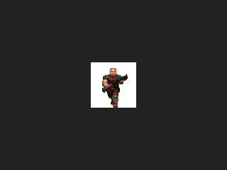
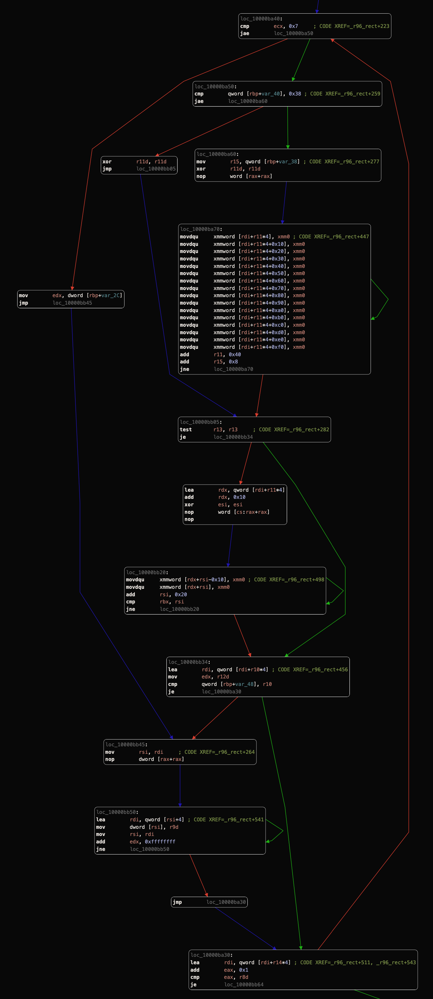
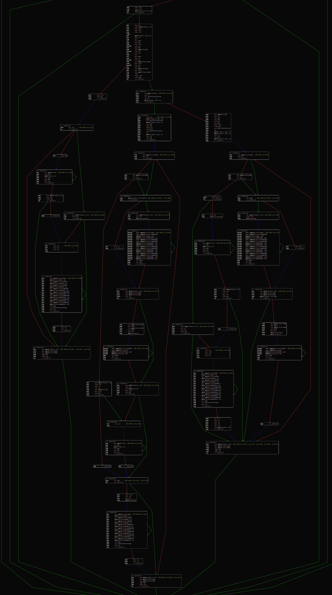
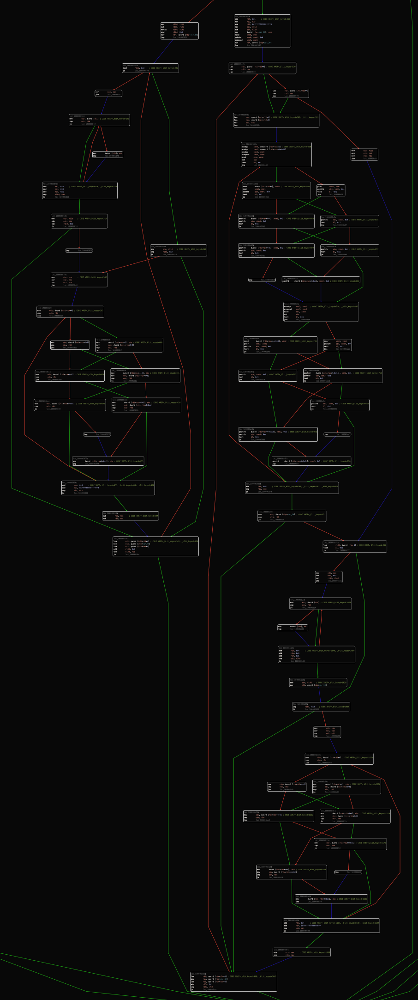
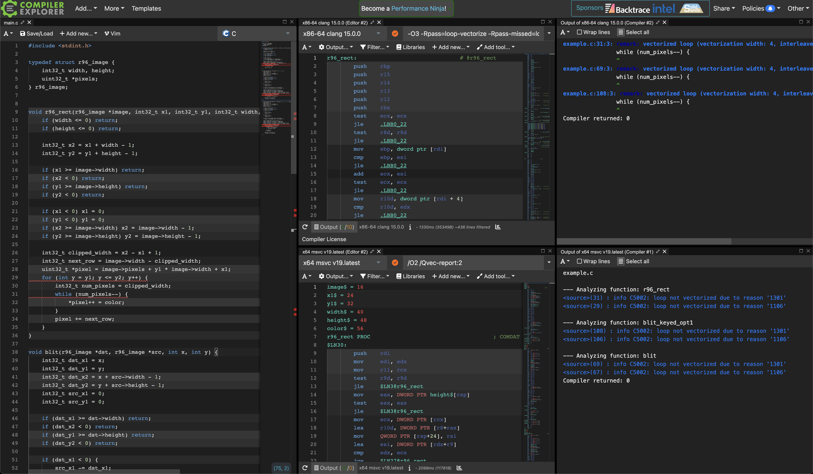

{{
metadata = {
	title: "Rendering like it's 1996 - Image file loading and blitting",
	summary: "Load image files and blit them to the screen.",
	image: "amiga500.jpeg",
	date: parseDate("2022/12/15 21:00"),
	published: false,
}
}}

{{include "../../../_templates/post_header.bt.html"}}
{{include "../../../_templates/post_header.bt.html" as post}}
{{include "../_demo.bt.html" as demo}}

{{post.figure("amiga500.jpeg", "Niklas Therning's beige plastic god. Has a fast blitter too!")}}

<div class="table_of_contents"></div>

--markdown-begin

[Last time](../dont-be-square/), we drew some horizontal lines and rectangles, and figured out some general optimization approaches. Today, we're going to read files, load images, and draw the images to the screen!

As usual, we'll do some house keeping first.

## Simplifying the CMake build
Look at the [CMakeLists.txt](https://github.com/badlogic/r96/blob/dont-be-square-00/CMakeLists.txt) file. Here's an excerpt:

--markdown-end
{{post.code("CMakeLists.txt", "cmake",
`
add_executable(r96_00_basic_window "src/00_basic_window.c")
target_link_libraries(r96_00_basic_window LINK_PUBLIC minifb r96)

add_executable(r96_01_drawing_a_pixel "src/01_drawing_a_pixel.c")
target_link_libraries(r96_01_drawing_a_pixel LINK_PUBLIC minifb r96)

add_executable(r96_02_image "src/02_image.c")
target_link_libraries(r96_02_image LINK_PUBLIC minifb r96)

add_executable(r96_03_clear_profiling "src/03_clear_profiling.c")
target_link_libraries(r96_03_clear_profiling LINK_PUBLIC minifb r96)

add_executable(r96_04_hline "src/04_hline.c")
target_link_libraries(r96_04_hline LINK_PUBLIC minifb r96)

add_executable(r96_05_hline_opt "src/05_hline_opt.c")
target_link_libraries(r96_05_hline_opt LINK_PUBLIC minifb r96)

add_executable(r96_06_rect "src/06_rect.c")
target_link_libraries(r96_06_rect LINK_PUBLIC minifb r96)

add_executable(r96_07_rect_opt "src/07_rect_opt.c")
target_link_libraries(r96_07_rect_opt LINK_PUBLIC minifb r96)

...

    add_dependencies(r96_00_basic_window r96_web_assets)
    target_link_options(r96_00_basic_window PRIVATE "-sEXPORT_NAME=r96_00_basic_window")

    add_dependencies(r96_01_drawing_a_pixel r96_web_assets)
    target_link_options(r96_01_drawing_a_pixel PRIVATE "-sEXPORT_NAME=r96_01_drawing_a_pixel")

    add_dependencies(r96_02_image r96_web_assets)
    target_link_options(r96_02_image PRIVATE "-sEXPORT_NAME=r96_02_image")

    add_dependencies(r96_04_hline r96_web_assets)
    target_link_options(r96_04_hline PRIVATE "-sEXPORT_NAME=r96_04_hline")

    add_dependencies(r96_05_hline_opt r96_web_assets)
    target_link_options(r96_05_hline_opt PRIVATE "-sEXPORT_NAME=r96_05_hline_opt")

    add_dependencies(r96_06_rect r96_web_assets)
    target_link_options(r96_06_rect PRIVATE "-sEXPORT_NAME=r96_06_rect")

    add_dependencies(r96_07_rect_opt r96_web_assets)
    target_link_options(r96_07_rect_opt PRIVATE "-sEXPORT_NAME=r96_07_rect_opt")
`)}}
--markdown-begin

Adding a new demo is very tedious. We keep repeating ourselves, so let's fix that.

We start by cleaning-up all our targets:

--markdown-end
{{post.code("CMakeLists.txt", "cmake",`
add_library(r96 "src/r96/r96.c")
add_executable(r96_00_basic_window "src/00_basic_window.c")
add_executable(r96_01_drawing_a_pixel "src/01_drawing_a_pixel.c")
add_executable(r96_02_image "src/02_image.c")
add_executable(r96_03_clear_profiling "src/03_clear_profiling.c")
add_executable(r96_04_hline "src/04_hline.c")
add_executable(r96_05_hline_opt "src/05_hline_opt.c")
add_executable(r96_06_rect "src/06_rect.c")
add_executable(r96_07_rect_opt "src/07_rect_opt.c")
add_executable(r96_08_image_file "src/08_image_file.c")
add_executable(r96_09_blit "src/09_blit.c")
add_executable(r96_10_blit_keyed "src/10_blit_keyed.c")

add_custom_target(r96_assets
    COMMAND ${CMAKE_COMMAND} -E copy_directory
    ${CMAKE_CURRENT_SOURCE_DIR}/assets
    ${CMAKE_CURRENT_BINARY_DIR}/assets
)

add_custom_target(r96_web_assets
    COMMAND ${CMAKE_COMMAND} -E copy_directory
    ${CMAKE_CURRENT_SOURCE_DIR}/web
    ${CMAKE_CURRENT_BINARY_DIR}
)
`)}}
--markdown-begin

How nice! Each demo target is a single line that just specifies its name and the source file(s) its made from.

I also moved the `r96_web_assets` target, responsible for copying all `web/*.html` to the build folder, to the top level. And I added a new target called `r96_assets`. It copies anything in the `assets/` folder to the build folder.

Why do we need that? Going forward, we'll not just generate our data programmatically, but we'll also want to load image files and other data from disk. Any such assets will go in the `assets/` folder, and the target makes sure they will be available in the `build/` folder as well.

We also need to link the `minifb` and `r96`library targets to each demo target. And every demo target should depend on the `r96_assets` and `r96_web_assets` targets, so we'll always have up-to-date asset files in the build folder. And if we build with Emscripten, we also need to set linker options, including the `EXPORT_NAME` by which we can resolve the WASM module in JavaScript.

A lot of the repetitiveness in the old `CMakeLists.txt` file came from specifying all that information for every target over and over again. No more! Behold!

--markdown-end
{{post.code("CMakeLists.txt", "cmake",`
get_property(targets DIRECTORY "${_dir}" PROPERTY BUILDSYSTEM_TARGETS)
list(REMOVE_ITEM targets minifb r96 r96_assets r96_web_assets)
foreach(target IN LISTS targets)
    target_link_libraries(${target} LINK_PUBLIC minifb r96)
    add_dependencies(${target} r96_assets)
    if(EMSCRIPTEN)
        add_dependencies(${target} r96_web_assets)
        target_link_options(${target} PRIVATE
                "-sSTRICT=1"
                "-sENVIRONMENT=web"
                "-sLLD_REPORT_UNDEFINED"
                "-sMODULARIZE=1"
                "-sALLOW_MEMORY_GROWTH=1"
                "-sALLOW_TABLE_GROWTH"
                "-sMALLOC=emmalloc"
                "-sEXPORT_ALL=1"
                "-sEXPORTED_FUNCTIONS=[\"_malloc\",\"_free\",\"_main\"]"
                "-sASYNCIFY"
                "--no-entry"
                "-sEXPORT_NAME=${target}"
        )
    endif()
endforeach()
`)}}
--markdown-begin

Recent CMake versions let us list all targets that have been defined in some directory. We do that in the first line and assign the list to `targets`.

Next, we remove the all the non-demo targets from that list.

We then iterate through the remaining demo targets and link them with `minifb` and `r96` and make them depend on the `r96_assets` target. If we build with Emscripten, we also add the `r96_web_assets` target as a dependency, and set the additional linker options needed for Emscripten, including the `EXPORT_NAME` which is just the demo target name.

And bam, we are down from 95 gruesome lines of CMake, to 73. Even better: to add a new demo, we just need to add an `add_executable()` line, specifying the target name and the source file(s) and we're done. Very nice. On with more interesting things.

## Reading files from disk (or URL)
If you've done any file I/O in C previously, you'll likely know where we'll be going: [`fopen()`](https://man7.org/linux/man-pages/man3/fopen.3.html) and friends. That's mostly cross-platform, and we could even [use `fopen()` with Emscripten](https://emscripten.org/docs/getting_started/Tutorial.html#using-files).

But that comes with a few things I don't want: a virtual filesystem and quite an increase in size of the WASM module, as Emscripten will link in a bunch of stuff we won't really need.

So let's role our own file reading! We want to specify a file path and get a bunch of bytes back. We also want to know how many bytes have been read. And we want to wrap that raw pointer to the memory block that holds the read bytes in a resource type. Let's call that type [`r96_byte_buffer`](https://github.com/badlogic/r96/blob/blistering-fast-blits-00/src/r96/r96.h#L22):

--markdown-end
{{post.code("r96.h", "c", `
typedef struct r96_byte_buffer {
	uint8_t *bytes;
	size_t num_bytes;
} r96_byte_buffer;
`)}}
--markdown-begin

And here's the API to work with `r96_byte_buffer` instances, following the principles we've established last time:

--markdown-end
{{post.code("r96.h", "c", `
void r96_byte_buffer_init(r96_byte_buffer *buffer, size_t size);

bool r96_byte_buffer_init_from_file(r96_byte_buffer *buffer, const char *path);

void r96_byte_buffer_dispose(r96_byte_buffer *buffer);
`)}}
--markdown-begin

`r96_byte_buffer_init()` can be used if we want to allocate `num_bytes` bytes and keep track of both the ponter and the length of the buffer. We dispose `r96_byte_buffer` instances via, you guessed it, `r96_byte_buffer_dispose()`. I spare you the [implementation details](https://github.com/badlogic/r96/blob/blistering-fast-blits-00/src/r96/r96.c#LL14-L17C2).

The interesting one is `r96_byte_buffer_init_from_file()`. We need two implementations: one for the desktop and one for the web. Here's the desktop version:

--markdown-end
{{post.code("r96.c", "c", `
#ifndef __EMSCRIPTEN__
bool r96_byte_buffer_init_from_file(r96_byte_buffer *buffer, const char *path) {
	*buffer = (r96_byte_buffer){0};
	FILE *file = fopen(path, "rb");
	if (!file) return false;

	if (fseek(file, 0, SEEK_END)) goto _error;
	long int num_bytes = ftell(file);
	if (num_bytes == -1) goto _error;
	if (fseek(file, 0, SEEK_SET)) goto _error;

	buffer->num_bytes = num_bytes;
	buffer->bytes = R96_ALLOC_ARRAY(uint8_t, buffer->num_bytes);
	if (fread(buffer->bytes, sizeof(uint8_t), buffer->num_bytes, file) != buffer->num_bytes) goto _error;

	fclose(file);
	return true;

_error:
	fclose(file);
	if (buffer->bytes) R96_FREE(buffer);
	buffer->num_bytes = 0;
	return false;
}
#else
`)}}
--markdown-begin

Unceremonious with a creative use of `goto`. It will do. The real interesting bit is the Emscripten/web implementation, which will be used when `__EMSCRIPTEN__` is defined:

--markdown-end
{{post.code("r96.c", "c", `
#include <emscripten.h>

EM_ASYNC_JS(uint8_t *, load_file, (const char *path, size_t *size), {
	let url = "./" + UTF8ToString(path);
	let response = await fetch(url);
	if (!response.ok) return 0;
	let data = new Uint8Array(await response.arrayBuffer());
	let ptr = _malloc(data.byteLength);
	HEAPU8.set(data, ptr);
	HEAPU32[size >> 2] = data.byteLength;
	return ptr;
})

bool r96_byte_buffer_init_from_file(r96_byte_buffer *buffer, const char *path) {
	buffer->bytes = load_file(path, &buffer->num_bytes);
	return buffer->bytes != NULL;
}
#endif
`)}}
--markdown-begin

OK, there's JavaScript code in our C. We got to be strong now. It's how we can interact with the JavaScript world from our pristine C.

The [`EM_ASYNC_JS()`](https://emscripten.org/docs/porting/asyncify.html#making-async-web-apis-behave-as-if-they-were-synchronous) macro takes a function signature split up into return type, function name, and argument list, and the JavaScript implementation of the function. The macro will then generate a sort of trampoline that will call the JavaScript function from within WASM. The arguments are all passed as JavaScript numbers. And return values are numbers too.

The `_ASYNC_` part means, that the JavaScript function we define can use JavaScript's `await`, which will pause execution until the promise we wait for resolves. For our C code, it will look like `r96_byte_buffer_init()` is blocking. In reality, we hand back control to the browser, which will asynchronously download the data from the url (`path`).

The implementation itself resolves the passed in pointer `path` to a JavaScript string. We then throw that at [`fetch`](https://developer.mozilla.org/en-US/docs/Web/API/Fetch_API/Using_Fetch) as a URL relative to the URL the WASM module is being run from. `fetch()` will asynchronously download the content from that URL. We then allocate memory on the WASM heap through `_malloc()` and copy the downloaded content over. Then we set the number of read bytes to the memory location specified by `size` and return the pointer. Pretty straight forward!

In the `r96_byte_buffer_init_from_file()` we just call this fancy JavaScript function, which sets up the `r96_byte_buffer` based on the data returned from JavaScript. Fancy. Let's load some images.

## Loading images
If we had a more masochist streak, we'd now be delving into image file formats and write a custom parser. Luckily for us, someone else has already done all the work, and we'll just stand on those particular giant's shoulders. [Sean Barrett](https://nothings.org/) has created an impressive set of [header-only file libraries](https://github.com/nothings/stb), which are easy to use and small.

[stb_image](https://github.com/nothings/stb/blob/master/stb_image.h) is the go-to solution for light-weight image loading. I've copied the header file to `src/r96/`, then included it in `src/r96.c` as per the "installation" instructions:

--markdown-end
{{post.code("src/r96/r96.c", "c", `
#define STBI_NO_STDIO
#define STBI_NO_HDR
#define STBI_NO_LINEAR
#define STBI_ONLY_JPEG
#define STBI_ONLY_PNG
#define STB_IMAGE_IMPLEMENTATION
#include "stb_image.h"
`)}}
--markdown-begin

The last two lines would actually suffice, but we want our binaries to be as minimal as they can be. I thus disable usage of `stdio.h` APIs (we have our own file reading API now), HDR, and specify that we only want JPEG and PNG support. Finally, we define `STB_IMAGE_IMPLEMENTATION` and include the header, which will pull in all the function declarations and their definitions into `r96.c`. That's it!

And here's how we load image files into `r96_image`:

--markdown-end
{{post.code("src/r96/r96.c", "c", `
bool r96_image_init_from_file(r96_image *image, const char *path) {
	r96_byte_buffer buffer;
	if (!r96_byte_buffer_init_from_file(&buffer, path)) return false;
	image->pixels = (uint32_t *) stbi_load_from_memory(buffer.bytes, buffer.num_bytes, &image->width, &image->height, NULL, 4);
	r96_byte_buffer_dispose(&buffer);
	if (image->pixels == NULL) return false;
	return true;
}
`)}}
--markdown-begin

The new-fangled `r96_image_init_from_file()` takes an `r96_image` and a file path. We load the file contents via `r96_byte_buffer_init_from_file()`, then call `stbi_load_memory()` to decode the encoded image data to raw ARGB pixels, which get stored in the `r96_image` instance. If the image isn't ARGB, `stb_image` will helpfully convert it to that format for us.

## Demo: Loading images from files
Time for a new demo. I've added our first asset file `doom-grunt.png` to the `assets/` folder. Remember this little guy?

<center></img></center>

We can't really draw images yet, so we'll write a terminal app called [`08_image_file.c`](https://github.com/badlogic/r96/blob/blistering-fast-blits-00/src/08_image_file.c) that loads the image and spits out its dimensions:

--markdown-end
{{post.code("src/08_image_file.c", "c", `
#include <stdio.h>
#include "r96/r96.h"

int main(void) {
    r96_image image;
    if (!r96_image_init_from_file(&image, "assets/doom-grunt.png")) {
        printf("Couldn't load file 'assets/doom-grunt.png'\n");
        return -1;
    }
    printf("Loaded file 'assets/doom-grunt.png', %ix%i pixels\n", image.width, image.height);
    r96_image_dispose(&image);
    return 0;
}
`)}}
--markdown-begin

Which, as expected, prints `Loaded file 'assets/doom-grunt.png', 64x64 pixels`, both on the desktop and the web. Let's check if the pixels we loaded actually look like our little buddy above.

## Blitting images
[Blitting](https://en.wikipedia.org/wiki/Bit_blit), which stands for bit block transfer, is an age old computer graphics tradition. It's a stand in verb for when we want to get pixels from one or more images onto another, possibly involving some boolean operations per pixel. Systems like the Commodore or Amiga 500 were advertised to feature a dedicated blitting chip, indicating to the gaming afficiandos that that machine will give the games extra punch (if the game programmers choose to use the blitter).

### Copy blit
In the simplest case, we copy the pixels of a source image to some location on a destination image, overwriting whatever has been in those destination pixels before the blit.

--markdown-end
<div id="blit"></div>
<script>
{
let resX = 800; resY = 320;
let q5 = q5Diagram(resX, resY, "blit");
q5.blockSize(20);
let w = "#000", b = "#fff";
let pixels = [
    w, w, w, b, b, w, w, w,
    w, w, b, b, b, b, w, w,
    w, b, b, b, b, b, b, w,
    b, b, w, b, b, w, b, b,
    b, b, b, b, b, b, b, b,
    w, w, b, w, w, b, w, w,
    w, b, w, b, b, w, b, w,
    b, w, b, w, w, b, w, b
];

let rows = [];
for (let i = 0; i < 8; i++) {
    let row = {x: 3, y: 4 + i, p: pixels.slice(i * 8, i * 8 + 8)};
    let toTween = new TWEEN.Tween(row)
        .delay(i * 1000)
        .to({x: 23, y: 4 + i}, 1000)
        .easing(TWEEN.Easing.Quadratic.Out);
    let backTween = new TWEEN.Tween(row)
        .delay((8 - i) * 1000)
        .to({x: row.x, y: row.y}, 0);
    toTween.chain(backTween);
    backTween.chain(toTween);
    toTween.start();
    rows.push(row);
}

q5.draw = () => {
    q5.clear();
    q5.blockText("Source", 6.5, 2, "#bbb");
    q5.pixels(3, 4, 8, 8, pixels);

    q5.blockText("Destination", 27.5, 0, "#bbb");
    q5.grid(20, 2, 16, 12, "#bbb");

    q5.blockText("blit(4, 3)", 15, 7.5, "#bbb", "none");

    for (let i = 0; i < rows.length; i++) {
        let row = rows[i];
        q5.pixels(row.x, row.y, 8, 1, row.p);
    }

    TWEEN.update()
}
q5.loop();
}
</script>
--markdown-begin

The source image is copied row by row to the destination image. This is very similar to drawing a rectangle, except that we look up the color for each pixel in each row of the destination rectangle in the source image!

As usual, we also need to think about clipping. The arguments to our blitting function will be the destination image, the source image, and the `(x, y)` coordinates in the destination image to which the source image should be blitted to.

The `(x, y)` coordinates and the source image `width` and `height` define a rectangle in the destination image. We can clip this rectangle just like we clipped single-color rectangles before.

The pixel in the destination rectangle at `(x, y)` maps to the pixel in the source image at `(0, 0)`, the pixel at `(x + 1, y)` maps to `(1, 0)`, and so on.

If we clip the destination rectangle, then we'll need to make sure to only copy the corresponding subset of pixels from the source image:

--markdown-end
<div id="blit-clip"></div>
<script>
{
let resX = 800; resY = 320;
let q5 = q5Diagram(resX, resY, "blit-clip");
q5.blockSize(20);
let w = "#000", b = "#fff";
let pixels = [
    w, w, w, b, b, w, w, w,
    w, w, b, b, b, b, w, w,
    w, b, b, b, b, b, b, w,
    b, b, w, b, b, w, b, b,
    b, b, b, b, b, b, b, b,
    w, w, b, w, w, b, w, w,
    w, b, w, b, b, w, b, w,
    b, w, b, w, w, b, w, b
];

let rows = [];
for (let i = 1; i < 8; i++) {
    let row = {x: 6, y: 4 + i, p: pixels.slice(i * 8 + 3, i * 8 + 8)};
    let toTween = new TWEEN.Tween(row)
        .delay(i * 1000)
        .to({x: 20, y: 1 + i}, 1000)
        .easing(TWEEN.Easing.Quadratic.Out);
    let backTween = new TWEEN.Tween(row)
        .delay((8 - i) * 1000)
        .to({x: row.x, y: row.y}, 0);
    toTween.chain(backTween);
    backTween.chain(toTween);
    toTween.start();
    rows.push(row);
}

q5.draw = () => {
    q5.clear();
    q5.blockText("Source", 6.5, 2, "#bbb");
    q5.pixels(3, 4, 8, 8, pixels);

    q5.blockText("Destination", 27.5, 0, "#bbb");
    q5.grid(20, 2, 16, 12, "#bbb");

    q5.blockText("blit(-3, -1)", 15, 10.5, "#bbb", "none");

    q5.blockRect(17, 1, 8, 8, "#e0e");
    q5.blockRect(20, 2, 5, 7, "#0e0");

    for (let i = 0; i < rows.length; i++) {
        let row = rows[i];
        q5.pixels(row.x, row.y, 5, 1, row.p);
        q5.noFill();
        q5.stroke("#e00");
    }

    let bs = q5.blockSize();
    q5.strokeWeight(2);
    q5.stroke("#e0e");
    q5.rect(3 * bs, 4 * bs, 8 * bs, 8 * bs);
    q5.stroke("#0e0");
    q5.rect(6 * bs, 5 * bs, 5 * bs, 7 * bs);
    q5.strokeWeight(1);

    TWEEN.update()
}
q5.loop();
}
</script>
--markdown-begin

Sounds simple enough, especially since we've already done pretty much everything except copying pixels in `r96_rect()`. Let's put it into code.

### Demo: blitting DOOM guy
I've created a new demo called [`09_blit.c`](https://github.com/badlogic/r96/blob/blistering-fast-blits-00/src/09_blit.c). Here it is in all its glory:

--markdown-end
{{post.code("src/09_blit.c", "c", `
#include <MiniFB.h>
#include <stdio.h>
#include "r96/r96.h"
#include <math.h>

void blit(r96_image *dst, r96_image *src, int x, int y) {
	int32_t dst_x1 = x;
	int32_t dst_y1 = y;
	int32_t dst_x2 = x + src->width - 1;
	int32_t dst_y2 = y + src->height - 1;
	int32_t src_x1 = 0;
	int32_t src_y1 = 0;

	if (dst_x1 >= dst->width) return;
	if (dst_x2 < 0) return;
	if (dst_y1 >= dst->height) return;
	if (dst_y2 < 0) return;

	if (dst_x1 < 0) {
		src_x1 -= dst_x1;
		dst_x1 = 0;
	}
	if (dst_y1 < 0) {
		src_y1 -= dst_y1;
		dst_y1 = 0;
	}
	if (dst_x2 >= dst->width) dst_x2 = dst->width - 1;
	if (dst_y2 >= dst->height) dst_y2 = dst->height - 1;

	int32_t clipped_width = dst_x2 - dst_x1 + 1;
	int32_t dst_next_row = dst->width - clipped_width;
	int32_t src_next_row = src->width - clipped_width;
	uint32_t *dst_pixel = dst->pixels + dst_y1 * dst->width + dst_x1;
	uint32_t *src_pixel = src->pixels + src_y1 * src->width + src_x1;
	for (int y = dst_y1; y <= dst_y2; y++) {
		int32_t num_pixels = clipped_width;
		while (num_pixels--) {
			*dst_pixel++ = *src_pixel++;
		}
		dst_pixel += dst_next_row;
		src_pixel += src_next_row;
	}
}

int main(void) {
	r96_image image;
	if (!r96_image_init_from_file(&image, "assets/doom-grunt.png")) {
		printf("Couldn't load file 'assets/doom-grunt.png'\n");
		return -1;
	}

	r96_image output;
	r96_image_init(&output, 320, 240);
	struct mfb_window *window = mfb_open("09_blit", output.width * 3, output.height * 3);

	do {
		r96_clear_with_color(&output, 0xff222222);
		blit(&output, &image, output.width / 2 - image.width / 2, output.height / 2 - image.height / 2);
		if (mfb_update_ex(window, output.pixels, output.width, output.height) < 0) break;
	} while (mfb_wait_sync(window));

	r96_image_dispose(&image);
	r96_image_dispose(&output);
	return 0;
}
`)}}
--markdown-begin

Let's get `main()` out of the way first. We load the `doom-grunt.png` image, set up an output `r96_image` to which we render, and which is later drawn to the window via `mfb_update_ex()`. We create the window and enter the main loop, where we clear the output image, draw the grunt at the center of the output image, and tell `minifb` to show our output pixels into the window. Not very surprising.

The interesting bits are located in the `blit()` function. It takes the destination image, the source image, and the location at which we should render the source image in the destination image.

Lines 7-10 then setup the destination rectangle, based on the provided `(x, y)` coordinates and the source image `width` and `height`.

Lines 11-12 define the coordinates from which we'll start fetch pixels from the source image.

Lines 14-17 do the trivial rejection test, like we did in `r96_rect()`, for when the destination rectangle is entirely outside the destination image.

Lines 19-28 are also copied almost verbatim from `r96_rect()` and clip the destination rectangle in case it is partially outside the destination image. Note that if the top left corner of the destination rectangle is outside the top and left bounds of the destination image, we also adjust `src_x1` and `src_y1`, the location from where we start fetching pixels from the source image.

We're done with clipping and proceed to calculate our loop invariants. Those should look familiar too. The only additions compared to `r96_rect()` are `src_next_row` and `src_pixel`, which are analogous to `dst_next_row` and `dst_pixel`, except they are used to access and iterate pixels in the source image. We start those off at the potentially clipped `src_x1` and `src_y1`!

The inner loop then iterates over all visible pixels of the destination rectangle, row by row. Instead of setting the destination pixels to a fixed color like in `r96_color()`, we look up the pixel color in the source image pixel that corresponds to the current destination image pixel.

And here it is in action:

--markdown-end
{{demo.r96Demo("09_blit", false)}}
--markdown-begin

Welcome to graphics programming!

### Color format conversion
Turns out that `stb_image` returns pixels in the ABGR format instead of ARGB. Let's fix that in `r96_image_init_from_file()`:

--markdown-end
{{post.code("src/r96/r96.c", "c", `
bool r96_image_init_from_file(r96_image *image, const char *path) {
	r96_byte_buffer buffer;
	if (!r96_byte_buffer_init_from_file(&buffer, path)) return false;
	image->pixels = (uint32_t *) stbi_load_from_memory(buffer.bytes, buffer.num_bytes, &image->width, &image->height, NULL, 4);
	r96_byte_buffer_dispose(&buffer);
	if (image->pixels == NULL) return false;

	uint8_t *bytes = (uint8_t *)image->pixels;
	int n = image->width * image->height * sizeof(uint32_t);
	for (int i = 0; i < n; i += 4) {
		uint8_t b = bytes[i];
		bytes[i] = bytes[i + 2];
		bytes[i + 2] = b;
	}
	return true;
}
`)}}
--markdown-begin

We swap the `r` and `b` component of each pixel and call it a day:

<center></center>

Much better, but not quite perfect yet.

### Keyed blit
Little DOOM guy has a bad case of black rectangle background. In the source image, those pixels all have the value `0x00000000`. To get rid of those pixels when blitting, we'll need a new blitter: a [color keying](https://en.wikipedia.org/wiki/Chroma_key) blitter.

Before we write the source pixel color to the destination pixel, we check if it is equal to a color key we specify. If it is, we leave the destination pixel alone, and move on to the next pixel. That's it!

### Demo: color keying DOOM guy
Pretty straight forward, as the next demo called `10_blit_keyed.c` shows:

--markdown-end
{{post.code("src/10_blit_keyed.c", "c", `
#include <MiniFB.h>
#include <stdio.h>
#include "r96/r96.h"
#include <math.h>

void blit_keyed(r96_image *dst, r96_image *src, int x, int y, uint32_t color_key) {
	int32_t dst_x1 = x;
	int32_t dst_y1 = y;
	int32_t dst_x2 = x + src->width - 1;
	int32_t dst_y2 = y + src->height - 1;
	int32_t src_x1 = 0;
	int32_t src_y1 = 0;

	if (dst_x1 >= dst->width) return;
	if (dst_x2 < 0) return;
	if (dst_y1 >= dst->height) return;
	if (dst_y2 < 0) return;

	if (dst_x1 < 0) {
		src_x1 -= dst_x1;
		dst_x1 = 0;
	}
	if (dst_y1 < 0) {
		src_y1 -= dst_y1;
		dst_y1 = 0;
	}
	if (dst_x2 >= dst->width) dst_x2 = dst->width - 1;
	if (dst_y2 >= dst->height) dst_y2 = dst->height - 1;

	int32_t clipped_width = dst_x2 - dst_x1 + 1;
	int32_t dst_next_row = dst->width - clipped_width;
	int32_t src_next_row = src->width - clipped_width;
	uint32_t *dst_pixel = dst->pixels + dst_y1 * dst->width + dst_x1;
	uint32_t *src_pixel = src->pixels + src_y1 * src->width + src_x1;
	for (int y = dst_y1; y <= dst_y2; y++) {
		int32_t num_pixels = clipped_width;
		while (num_pixels--) {
			uint32_t color = *src_pixel;
			src_pixel++;
			if (color == color_key) {
				dst_pixel++;
				continue;
			}
			*dst_pixel++ = color;
		}
		dst_pixel += dst_next_row;
		src_pixel += src_next_row;
	}
}

int main(void) {
	r96_image image;
	if (!r96_image_init_from_file(&image, "assets/doom-grunt.png")) {
		printf("Couldn't load file 'assets/doom-grunt.png'\n");
		return -1;
	}

	r96_image output;
	r96_image_init(&output, 320, 240);
	struct mfb_window *window = mfb_open("10_blit_keyed", output.width * 3, output.height * 3);

	do {
		r96_clear_with_color(&output, 0xff222222);
		blit_keyed(&output, &image, output.width / 2 - image.width / 2, output.height / 2 - image.height / 2, 0x00000000);
		if (mfb_update_ex(window, output.pixels, output.width, output.height) < 0) break;
	} while (mfb_wait_sync(window));

	r96_image_dispose(&image);
	r96_image_dispose(&output);
	return 0;
}
`)}}
--markdown-begin

The code is exactly the same, except for lines 40-43, where we snuck in a little `if` statement that ensures we skip pixels that match the `color_key`. The color key is specified as a parameter to `blit_keyed()` in line 64. That's it!

Now DOOM guy is free from the shackles of his black rectangle background.

--markdown-end
{{demo.r96Demo("10_blit_keyed", false)}}
--markdown-begin

### Demo: shoddy blitting micro benchmark
How fast are our blitting functions? We can use `r96_rect()` as a base-line. It performs all the same operations, except the look-up of the pixel color in the source image. We can consider it our idealized best case scenario. Here's demo [`11_blit_perf.c`](https://github.com/badlogic/r96/blob/blistering-fast-blits-00/src/11_blit_perf.c) which implements a shoddy micro benchmark.

--markdown-end
{{post.code("src/11_blit_perf.c", "c", `
#include <MiniFB.h>
#include <stdio.h>
#include "MiniFB_enums.h"
#include "r96/r96.h"
#include <math.h>
#include <string.h>

void blit(r96_image *dst, r96_image *src, int x, int y) {
	// ... as above
}

void blit_keyed(r96_image *dst, r96_image *src, int x, int y, uint32_t color_key) {
	// ... as above
}

int main(void) {
	r96_image image;
	if (!r96_image_init_from_file(&image, "assets/doom-grunt.png")) {
		printf("Couldn't load file 'assets/doom-grunt.png'\n");
		return -1;
	}

	r96_image output;
	r96_image_init(&output, 320, 240);
	struct mfb_window *window = mfb_open("11_blit_perf", output.width * 3, output.height * 3);
	struct mfb_timer *timer = mfb_timer_create();
	do {
		r96_clear_with_color(&output, 0xff222222);

        srand(0);
		mfb_timer_reset(timer);
		for (int i = 0; i < 20000; i++) {
			r96_rect(&output, rand() % output.width, rand() % output.height, 64, 64, 0xffffffff);
		}
		printf("rect()       %f\n", mfb_timer_delta(timer));

        srand(0);
		mfb_timer_reset(timer);
		for (int i = 0; i < 20000; i++) {
			blit(&output, &image, rand() % output.width, rand() % output.height);
		}
		printf("blit()       %f\n", mfb_timer_delta(timer));

        srand(0);
		mfb_timer_reset(timer);
		for (int i = 0; i < 20000; i++) {
			blit_keyed(&output, &image, rand() % output.width, rand() % output.height, 0x0);
		}
		printf("blit_keyed() %f\n", mfb_timer_delta(timer));

		if (mfb_update_ex(window, output.pixels, output.width, output.height) < 0) break;
	} while (mfb_wait_sync(window));

	mfb_timer_destroy(timer);
	r96_image_dispose(&image);
	r96_image_dispose(&output);
	return 0;
}
`)}}
--markdown-begin

I've omitted the implementations of `blit()` and `blit_keyed()` for brevity's sake. The benchmark itself times drawing `20000` rectangles, `20000` DOOM grunts without color keying, and `20000` DOOM grunts with color keying. Each rectangle has a fixed size of 64x64 pixels, the same size as the DOOM grunt image, to make the comparison somewhat fairer. Here's some output on my machine using Clang.

```
rect()       0.005832
blit()       0.006717
blit_keyed() 0.013974
rect()       0.005910
blit()       0.006602
blit_keyed() 0.014015
rect()       0.005946
blit()       0.006691
blit_keyed() 0.014020
```

`r96_rect()` and `blit()` are pretty close performance-wise. However, `blit_keyed()` is twice as slow as either of these. That's not great. Let's investigate.

## Hey dude, where's my auto-vectorization?
Here are just the (inner) loops of `r96_rect()`, `blit()`, and `blit_keyed()`:

```
// r96_rect()
for (int y = y1; y <= y2; y++) {
    int32_t num_pixels = clipped_width;
    while (num_pixels--) {
        *pixel++ = color;
    }
    pixel += next_row;
}

// blit()
for (int y = dst_y1; y <= dst_y2; y++) {
    int32_t num_pixels = clipped_width;
    while (num_pixels--) {
        *dst_pixel++ = *src_pixel++;
    }
    dst_pixel += dst_next_row;
    src_pixel += src_next_row;
}

// blit_keyed()
for (int y = dst_y1; y <= dst_y2; y++) {
    int32_t num_pixels = clipped_width;
    while (num_pixels--) {
        uint32_t color = *src_pixel;
        src_pixel++;
        if (color == color_key) {
            dst_pixel++;
            continue;
        }
        *dst_pixel++ = color;
    }
    dst_pixel += dst_next_row;
    src_pixel += src_next_row;
}
```

`blit()` does a little more work in the inner loop by fetching the source image pixel color, but is otherwise equivalent to `r96_rect()`. The minor slow-down can be explained by that additional work. Thankfully the impact isn't huge, most likely due to good caching of the source image pixels in the [L1 cache of the CPU](https://en.wikipedia.org/wiki/CPU_cache).

`blit_keyed()`, on the other hand, does quite a bit more work. It's also a bit convoluted. Let's clean it up. I created a copy of `blit_keyed()` in `11_blit_perf.c` called `blit_keyed_opt1()`, and replaced the loop with this:

```
for (int y = dst_y1; y <= dst_y2; y++) {
    int32_t num_pixels = clipped_width;
    while (num_pixels--) {
        uint32_t color = *src_pixel;
        if (color != color_key) {
            *dst_pixel = color;
        }
        src_pixel++;
        dst_pixel++;
    }
    dst_pixel += dst_next_row;
    src_pixel += src_next_row;
}
```

I then added a new timing loop in `main()` in `11_blit_perf.c`. Here are the new results:

```
rect()            0.005780
blit()            0.006572
blit_keyed()      0.013927
blit_keyed_opt1() 0.013758
rect()            0.005887
blit()            0.006622
blit_keyed()      0.013951
blit_keyed_opt1() 0.013832
rect()            0.005892
blit()            0.006708
blit_keyed()      0.013938
blit_keyed_opt1() 0.013739
```

That didn't change anything. Since our `blit_keyed_opt1()` loop is as simple as it can get, it's time to look at the generated assembly.

### Looking at assembly control flow graphs
This time however, we'll start by looking at the [control flow graph](https://en.wikipedia.org/wiki/Control-flow_graph) of the generated assembly. That's a bit easier to follow than the linear listing we get from [Godbolt Compiler Explorer](https://godbolt.org).

I'm using the [Hopper](https://www.hopperapp.com/) disassembler to generate those fancy CFG images below from the demo executable `11_blit_perf`.

> **Note**: to generate the CFGs, I disabled LTO in the `CMakeLists.txt` file. Otherwise the linker would inline `blit()`, `blit_keyed()`, and `blit_keyed_opt1()`. The results are the same.

Here's the loop in `r96_rect()` as a CFG:

<center></center>

Without going into too much detail, the important part of that graphic is the big fat block of `movdqu` instructions. If you see that generated for one of your memory moving loops, then you can be pretty sure the compiler has managed to vectorize large parts of your loop with [SIMD](https://en.wikipedia.org/wiki/Single_instruction,_multiple_data) instructions. This is know as [auto-vectorization](https://en.wikipedia.org/wiki/Automatic_vectorization) and we always want that for our loops, if possible.

The [`movdqu`](https://c9x.me/x86/html/file_module_x86_id_184.html) instruction moves the 16-bytes stored in a 128-bit SSE register like `xmm0` into an unaligned memory location. Unaligned means the memory address is not a multiple of 16.

In the `r96_rect()` case, the compiler has filled the 16-bytes of the `xmm0` register with 4 copies of the rectangle's color (which happened before the loop pictured above). Every `movdqu` we see then writes that color to 4 pixels at a time.

There are actually multiple blocks using `movdqu` in the loop. Which one is used depends on how many pixels need to still be written to in a row.

The big one with label `loc_10000ba700` and 16 `movdqu` instructions is for the case where at least 256 bytes (or 64 pixels) are still to be written.

The smaller block with label `loc_10000bb20` and two `movdqu` instructions is used when at least 32-bytes (or 8 pixels) are still to be written.

For the case that less than 32-bytes still need to be written, the block with label `loc_10000bb50` is used. This one writes 4 bytes (or 1 pixel) at a time via the `mov` instruction.

That's pretty good, albeit not optimal. E.g. we could rewrite this manually in assembly to ensure we can use `movdqa` for aligned memory writes, which will generally yield better throughput.

However, as we don't want to drop down to assembly, we'll consider this to be good enough. It also means we don't have to special case for different “CPU" architectures like x86_64, ARM64, or WebAssembly.

Here's what the CFG of the `blit()` loop looks like.

<center></center>

It's a CFG for ants! You can open this [PDF](blit_cfg.pdf) if you want the details. If you squint hard enough, you can see blocks of [`movups`](https://c9x.me/x86/html/file_module_x86_id_208.html) instructions. That instruction is misappropriated by the compiler to move 4 pixel colors read from the source image to the destination image at once, despite the fact that the pixel colors are `uint32_t` and not single-precision floats. Since we don't do any arithmetic on the values, this is fine.

As in the `r96_rect()` case, the compiler generated a bunch of specialized control flows, depending on how many pixels in a row are left to be written. The additional work of having to read the source pixels complicates the control flow considerably. However, the principle remains the same. The compiler managed to auto-vectorize the inner loop of `blit()`, yielding performance that's in the same ball park as the equally auto-vectorized `r96_rect()`. Not bad!

So what does our twice as slow `blit_keyed_opt1()`  look like?

<center></center>

That's not great. We don't even have to dig deeply into this to see the issue. The compiler generated two big branches. The one on the left doesn't use any SIMD instructions, while the one on the right tries its hardest to use SIMD but devolves into a ball of conditional jumps.

That alone will kill any performance gained from using SIMD to read/write more than 1 pixel at once. Have a look at the [PDF](blit_keyed_cfg.pdf) if you want to see the gory details.

Clearly, Clang can't deal with this simple `if` conditional in the inner loop. What about other compilers? And how can we make them generate passable vectorized code?

## Asking the compiler why auto-vectorization goes wrong
Time to switch to the [Godbolt compiler explorer](https://godbolt.org). I've pasted in `r96_rect()`, `blit()`, and `blit_keyed_opt1()` from above, plus the `r96_image` struct. I then set up Clang x86_64 and MSVC x86_64 with compiler flags that will make the compiler tell us what they vectorized, what they couldn't vectorize, and why.

The flags to get auto-vectorization reports for Clang are:

```
-O3 -Rpass=loop-vectorize -Rpass-missed=loop-vectorize -Rpass-analysis=loop-vectorize -gline-tables-only -gcolumn-info
```

The flags for MSVC are:

```
/O2 /Qvec-report:2
```

Open this [Godbolt "project"](https://www.godbolt.org/z/5s9Ed6Ed8) to follow along.

<center></center>

Clang tells us this:

```
// r96_rect()
example.c:31:3: remark: vectorized loop (vectorization width: 4, interleaved count: 2) [-Rpass=loop-vectorize]
                while (num_pixels--) {
                ^

// blit()
example.c:69:3: remark: vectorized loop (vectorization width: 4, interleaved count: 2) [-Rpass=loop-vectorize]
                while (num_pixels--) {
                ^

// blit_keyed_opt1()
example.c:153:3: remark: vectorized loop (vectorization width: 4, interleaved count: 2) [-Rpass=loop-vectorize]
                while (num_pixels--) {
                ^
```

Lier, lier, pants on fire! OK, it DID vectorize `blit_keyed_opt1()`, but the vectorization doesn't have any positive effect on performance.

MSVC is interesting too.

```
--- Analyzing function: r96_rect
<source>(31) : info C5002: loop not vectorized due to reason '1301'
<source>(29) : info C5002: loop not vectorized due to reason '1106'

--- Analyzing function: blit_keyed_opt1
<source>(108) : info C5002: loop not vectorized due to reason '1301'
<source>(106) : info C5002: loop not vectorized due to reason '1106'

--- Analyzing function: blit
<source>(69) : info C5002: loop not vectorized due to reason '1301'
<source>(67) : info C5002: loop not vectorized due to reason '1106'
```

Thank you, MSVC, I LOVE having to look up error and reason codes on the interweb instead of having you tell me directly what's up.

MSVC didn't manage to vectorize any of the loops. The reasons given can be found [here](https://learn.microsoft.com/en-us/cpp/error-messages/tool-errors/vectorizer-and-parallelizer-messages?view=msvc-170). I have reproduced them here, so you don't have to look them up.

* *1106*: outer loop not vectorized.
* *1301*: loop stride isn't +1.

We can ignore `1106`. It seems that MSVC can not deal with `while(num_pixels--)`.

### Fulfilling MSVC +1 loop stride requirement

We can fix that by replacing

```
int32_t num_pixels = clipped_width;
while (num_pixels--) {
```

with

```
for (int i = 0; i < clipped_width; i++) {
```

I've fixed this up in `r96_rect()` and `blit()`, and made a copy of `blit_keyed_opt1()` called `blit_keyed_opt2()` which also has the fix. I then added a new timing loop for `blit_keyed_opt2()` to `main()`. Let's see if this helps with Clang as well:

```
rect()            0.005757
blit()            0.006615
blit_keyed()      0.014153
blit_keyed_opt1() 0.013896
blit_keyed_opt2() 0.014292
rect()            0.005766
blit()            0.006537
blit_keyed()      0.014316
blit_keyed_opt1() 0.014213
blit_keyed_opt2() 0.014659
rect()            0.005904
blit()            0.006693
blit_keyed()      0.014274
blit_keyed_opt1() 0.014215
blit_keyed_opt2() 0.014698
```

Welp, that didn't make any impact with Clang in terms of performance. We still get the "bad" vectorization in `blit_keyed_xxx()`.

Checking the [updated Godbolt "project"](https://www.godbolt.org/z/rE6v6zYd8), we can see that MSVC is now a bit happier, but not much.

```
--- Analyzing function: r96_rect
<source>(29) : info C5002: loop not vectorized due to reason '1106'

--- Analyzing function: blit
<source>(67) : info C5002: loop not vectorized due to reason '1300'
<source>(66) : info C5002: loop not vectorized due to reason '1106'

--- Analyzing function: blit_keyed_opt2
<source>(105) : info C5002: loop not vectorized due to reason '1100'
<source>(104) : info C5002: loop not vectorized due to reason '1106'
Compiler returned: 0
```

It managed to vectorize the inner loop of `r96_rect()` given our change via `rep stosd` (yes, that too is kinda vectorized).

But it still fails for the inner loops of `blit()` (reason `1300`) and `blit_keyed_opt2()` (reason `1100`):

* **1300**: Loop body contains little or no computation.
* **1100**: Loop contains control flow—for example, "if" or "?:".

To `1300` for `blit()`'s inner-loop I say: are you kidding me, MSVC?! Clang thinks `blit()` has a vectorization worthy inner loop, and the benchmark data indicates that it's right. MSVC just throws its hands up in the air and refuses to vectorize the loop. Lazy compiler!

The `1100` indicates, that the MSVC auto-vectorizer is not very good, given that the conditional could be easily translated to a masking SIMD operation (also known as [if-conversion](https://llvm.org/docs/Vectorizers.html#if-conversion)). But Clang also fails to do that properly.

### Throwing "engineering" at the wall

Where to go from here? Like any self-respecting engineer, we're going to blindly throw some best guesses at the wall. But only after we've read [A Guide to Vectorization with Intel C++ Compilers](https://d3f8ykwhia686p.cloudfront.net/1live/intel/CompilerAutovectorizationGuide.pdf). While this is supposed to apply to Intel's compiler, some of the take-aways surely apply to the auto-vectorizers of MSVC, Clang, and GCC as well. These compilers sadly don't have great documentation on how to make their auto-vectorizers happy.

Let's start by making a copy of `blit_keyed_opt2()` called `blit_keyed_opt3()`, and add a timing loop to `main()` in `11_blit_perf.c`. We change the loop in `blit_keyed_opt3()` to this:

```
for (int y = dst_y1; y <= dst_y2; y++) {
    for (int i = 0; i < clipped_width; i++) {
        uint32_t color = src_pixel[i];
        if (color != color_key) {
            dst_pixel[i] = color;
        }
    }
    dst_pixel += dst_next_row + clipped_width;
    src_pixel += src_next_row + clipped_width;
}
```

Maybe using indexing helps?

Here are the micro-benchmark results using Clang:

```
rect()            0.005971
blit()            0.006769
blit_keyed()      0.014510
blit_keyed_opt1() 0.014074
blit_keyed_opt2() 0.014133
blit_keyed_opt3() 0.014629
rect()            0.005901
blit()            0.006527
blit_keyed()      0.014326
blit_keyed_opt1() 0.014038
blit_keyed_opt2() 0.014092
blit_keyed_opt3() 0.014609
rect()            0.005847
blit()            0.006499
blit_keyed()      0.014212
blit_keyed_opt1() 0.014082
blit_keyed_opt2() 0.014100
blit_keyed_opt3() 0.014660
```

No change in performance with Clang. On the Godbolt site, Clang still claims everything is awesome regarding vectorization. MSVC is still unable to vectorize the loop, which makes sense, as we didn't kill the `if` statement.

Another! `blit_keyed_opt4()` has this loop:

```
for (int y = dst_y1; y <= dst_y2; y++) {
    for (int i = 0; i < clipped_width; i++) {
        uint32_t src_color = *src_pixel;
        uint32_t dst_color = *dst_pixel;
        *dst_pixel = src_color != color_key ? src_color : dst_color;
        src_pixel++;
        dst_pixel++;
    }
    dst_pixel += dst_next_row;
    src_pixel += src_next_row;
}
```

The idea behind this is that the tenary `?:` operator can be reduced to a mathematical expression instead of a conditional jump. That should allow the vectorizer to do its job. Yes, it will fetch a pixel from the destination image, but that will also be in the cache in all likely-hood.

Here are the micro-benchmark results using Clang:

```
rect()            0.006127
blit()            0.006699
blit_keyed()      0.014528
blit_keyed_opt1() 0.014335
blit_keyed_opt2() 0.014485
blit_keyed_opt3() 0.014895
blit_keyed_opt4() 0.008150
rect()            0.006011
blit()            0.006728
blit_keyed()      0.014591
blit_keyed_opt1() 0.014346
blit_keyed_opt2() 0.014278
blit_keyed_opt3() 0.014840
blit_keyed_opt4() 0.008113
rect()            0.005955
blit()            0.006719
blit_keyed()      0.014357
blit_keyed_opt1() 0.014152
blit_keyed_opt2() 0.014221
blit_keyed_opt3() 0.014668
blit_keyed_opt4() 0.008134
```

Holy cow, that did it for Clang! What does the vectorization report from MSVC say? [See for yourself in Godbolt Compiler Explorer](https://www.godbolt.org/z/KhreMaex9)

```
--- Analyzing function: blit_keyed_opt1
<source>(152) : info C5002: loop not vectorized due to reason '1301'
<source>(150) : info C5002: loop not vectorized due to reason '1106'

--- Analyzing function: r96_rect
<source>(29) : info C5002: loop not vectorized due to reason '1106'

--- Analyzing function: blit
<source>(68) : info C5002: loop not vectorized due to reason '1300'
<source>(67) : info C5002: loop not vectorized due to reason '1106'

--- Analyzing function: blit_keyed
<source>(107) : info C5002: loop not vectorized due to reason '1301'
<source>(105) : info C5002: loop not vectorized due to reason '1106'

--- Analyzing function: blit_keyed_opt2
<source>(195) : info C5002: loop not vectorized due to reason '1100'
<source>(194) : info C5002: loop not vectorized due to reason '1106'

--- Analyzing function: blit_keyed_opt3
<source>(238) : info C5002: loop not vectorized due to reason '1100'
<source>(237) : info C5002: loop not vectorized due to reason '1106'

--- Analyzing function: blit_keyed_opt4
<source>(279) : info C5001: loop vectorized
<source>(278) : info C5002: loop not vectorized due to reason '1106'
```

Hallelujah, it vectorized the inner loop of `blit_keyed_opt4()`. The inner loop of `blit()` is still not vectorized (we didn't change it). How bad is that? Let's run the micro-benchmark on Windows with MSVC:

```
rect()                  0.023023
blit()                  0.038542
blit_keyed()            0.051895
blit_keyed_opt1()       0.048662
blit_keyed_opt2()       0.048759
blit_keyed_opt3()       0.056734
blit_keyed_opt4()       0.012353
rect()                  0.023163
blit()                  0.037512
blit_keyed()            0.050863
blit_keyed_opt1()       0.050506
blit_keyed_opt2()       0.049140
blit_keyed_opt3()       0.057044
blit_keyed_opt4()       0.012292
rect()                  0.023217
blit()                  0.037487
blit_keyed()            0.050150
blit_keyed_opt1()       0.050790
blit_keyed_opt2()       0.048245
blit_keyed_opt3()       0.056707
blit_keyed_opt4()       0.012285
```

MSVC is really, really special... Now `blit_keyed_opt4()` is faster than `r96_rect()` and `blit()`, even tho on paper it does a ton more work. I guess when MSVC vectorizes, it vectorizes real good. In absolute wall clock time, the code runs slower on my super beefy x86_64 DOOM slayer Windows machine than on my ARM64 M1 Max MacBook Pro. But such is life.

Both `r96_rect()` and `blit()` have trivial loops, which MSVC should be able to optimize, especially in case of `r96_rect()`, where there can not be any aliasing between destination and source. Alas, it seems this is a [known issue](https://developercommunity.visualstudio.com/t/c-compiler-neither-vectorizes-trivial-code/825901).

Interestingly, MSVC reports that the inner loop of `rect()` was vectorized. It did so via [`rep stosd`](https://faydoc.tripod.com/cpu/stosd.htm), which it considers a vectorization primitive. I guess since `rect()` is now slower than `blit_keyed_opt4()`, we can firmly state that `rep stosd` is not a great vectorization primitive. It's a super old instruction that was available even before MMX. So, why is MSVC reporting the inner loop as vectorized again?

What about WebAssembly? There, we don't have any SIMD support (yet).

```
rect()                  0.021600
r96_11_blit_perf.js:9 blit()                  0.038100
r96_11_blit_perf.js:9 blit_keyed()            0.050900
r96_11_blit_perf.js:9 blit_keyed_opt1()       0.055500
r96_11_blit_perf.js:9 blit_keyed_opt2()       0.063100
r96_11_blit_perf.js:9 blit_keyed_opt3()       0.063400
r96_11_blit_perf.js:9 blit_keyed_opt4()       0.069900
r96_11_blit_perf.js:9 rect()                  0.021700
r96_11_blit_perf.js:9 blit()                  0.037800
r96_11_blit_perf.js:9 blit_keyed()            0.050800
r96_11_blit_perf.js:9 blit_keyed_opt1()       0.055400
r96_11_blit_perf.js:9 blit_keyed_opt2()       0.063600
r96_11_blit_perf.js:9 blit_keyed_opt3()       0.064200
r96_11_blit_perf.js:9 blit_keyed_opt4()       0.069400
r96_11_blit_perf.js:9 rect()                  0.021300
r96_11_blit_perf.js:9 blit()                  0.036700
r96_11_blit_perf.js:9 blit_keyed()            0.050500
r96_11_blit_perf.js:9 blit_keyed_opt1()       0.056100
r96_11_blit_perf.js:9 blit_keyed_opt2()       0.063400
r96_11_blit_perf.js:9 blit_keyed_opt3()       0.063500
r96_11_blit_perf.js:9 blit_keyed_opt4()       0.070600
```

`blit_keyed_opt4()` now loses out against the other variants. We could `#ifdef` our way out of this and use the best performing version on each platform. For maintainabilities sake, we won't do that though.

> **Note:** yes, yes, I'm aware we could squeeze out a lot more performance if we went all in with SIMD intrinsics. But as I said earlier, I'd rather not get platform specific optimizations into the code base. The auto-vectorizers are good enough.

## Next up
What a journey!

Discuss this post on [Twitter]() or [Mastodon]().

--markdown-end
<script>tableOfContents()</script>

{{include "../../../_templates/post_footer.bt.html"}}